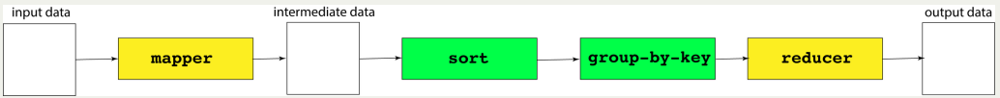

# Lecture 18. MapReduce

`MapReduce` is a parallel, distributed programming model and implementation used to process and generate large data sets.
- The `map` component of a MapReduce job typically parses input data and distills it down to some intermediate result.
- The `reduce` component of a MapReduce job collates these intermediate results and distills them down even further to the desired output.
- The pipeline of processes involved in a MapReduce job is captured by the below
illustration: 
- The processes shaded in yellow are programs specific to the data set being processed, whereas the processes shaded in green are present in all MapReduce pipelines.
- We'll invest some energy over the next several slides explaining what a mapper, a
reducer, and the group-by-key processes look like.

### Example 1: word counter

word-count-mapper.py
```py
import sys
import re

pattern = re.compile("^[a-z]+$") # matches purely alphabetic words
for line in sys.stdin:
    line = line.strip()
    tokens = line.split()
    for token in tokens:
        lowercaseword = token.lower()
        if pattern.match(lowercaseword):
            print '%s 1' % lowercaseword
```
group-by-key.py
```py
from itertools import groupby
from operator import itemgetter
import sys
 
def read_mapper_output(file):
    for line in file:
        yield line.strip().split(' ')
 
def main():
    data = read_mapper_output(sys.stdin)
    for key, keygroup in groupby(data, itemgetter(0)):
        values = ' '.join(sorted(v for k, v in keygroup))
        print "%s %s" % (key, values)
 
if __name__ == "__main__":
    main()
```
word-count-reducer.py
```py
import sys
 
def read_mapper_output(file):
    for line in file:
        yield line.strip().split(' ')
 
def main():
    data = read_mapper_output(sys.stdin)
    for vec in data:
        word = vec[0]
        count = sum(int(number) for number in vec[1:])
        print "%s %d" % (word, count)
 
if __name__ == "__main__":
    main()
```
So, we execute these by
```console
>cat anna-karenina.txt | ./word-count-mapper.py | sort | ./group-by-key.py | ./word-count-reducer.py
```


# Lecture 19. Principles of System Design

Principles of System Design: CS110 touches on seven such principles
- Abstraction
- Modularity and Layering
- Naming and Name Resolution
- Caching
- Virtualization
- Concurrency
- Client-server request-and-response

### Abstraction

- Separating behavior from implementation (e.g. sort has one interface, but many different implementations).
- Defining a clean interface that makes a library much easier to use.
- Lecturer provided nice interfaces for the assignments!
- Examples of abstractions we've taken for granted (or will soon take for granted) this quarter in CS110:
    - `filesystems` (you've dealt with C FILE *s and C++ iostreams for a while now, and knew little of how they might work until we studied them this quarter). We did learn about file descriptors this quarter, and we leverage that abstraction to make other data sources (e.g. networked servers) look and behave like files.
    - `processes` (you know how to fork off new processes now, even though you have no idea how `fork` and `execvp` work).
    - `signals` (you know they're used by the kernel to message a process that something significant occurred, but you don't know how they're implemented).
    - `threads` (you know how to create C++ `threads`, but you don't really know how they're implemented). 
    - `HTTP` (you're just now learning the protocol used to exchange text documents, images, audio files, etc.).

### Modularity and Layering

- Subdivision of a larger system into a collection of smaller subsystems, which themselves may be further subdivided into even smaller sub-subsystems.
- Example: `filesystems`, which use a form of modularity called `layering`, which is the organization of several modules that interact in some hierarchical manner, where each layer typically only opens its interface to the module above it. Recall the layering scheme we subscribed to for Assignment 2:
    - symbolic link layer
    - absolute path name layer
    - path name layer
    - file name layer
    - inode number layer
    - file layer
    - block layer
- Example: `g++`, which chains together a series of components in a pipeline (which is another form of layering).
    - the `preprocessor`, which manages `#includes`, `#defines`, and other preprocessor directives
    - to build a translation unit that is fed to...
    - the `lexer`, which reduces the translation unit down to a stream of tokens fed in sequence to...
    - the `parser`, which groups tokens into syntactically valid constructs then semantically verified by...
    - the `semantic analyzer`, which confirms that the syntactically valid constructs make sense and respect C++'s type system, so that x86 instructions can be emitted by...
    - the `code generator`, which translate your C++ code into equivalent machine code.
    - (Maybe) CS143 teaches it
- Example: `computer networks`, which rely on a programming model known as TCP/IP, so named because its two most important protocols (TCP for Transmission Control Protocol, IP for Internet Protocol) were the first to be included in the standard.
    - TCP/IP specifies how data should be packaged, transmitted, routed, and received.
    - The network stack implementation is distributed down through four different layers:
      - application layer (the highest layer in the stack)
      - transport layer
      - network layer [submarine cables](https://www.submarinecablemap.com/submarine-cable/flag-north-asia-loopreach-north-asia-loop)
      - link layer (the lowest layer in the stack)
      - (see [here](https://le-james94.medium.com/the-4-layer-internet-model-network-engineers-need-to-know-e78432614a4f) for more information about the layers)
    - We learned the application-layer API calls (socket, bind, etc.) needed to build networked applications.
    - CS144 teaches all four layers in detail and how each layer interacts with the one beneath it.


### Naming and Name Resolution

- Names provide a way to refer to system resources, and name resolution is a means for converting between human-readable names and machine-friendly ones.
- We've already seen two examples:
    - Humans prefer absolute and relative `pathnames` to identify files, and computers work better with inode and block numbers. You spent a good amount of energy with Assignment 2 managing the discovery of inode numbers and file block contents given a file's name.
    - Humans prefer domain names like www.google.com, but computers prefer IP addresses like 74.125.239.51.
    - We spent time in lecture understanding exactly how the domain name is converted to an IP address.
- Other examples: the `URL` (a human-readable form of a resource location), the `process ID` (a computer friendly way of referring to a process), and the `file descriptor` (a computer-friendly way of referring to a file, or something that behaves like a file—yay virtualization and abstraction!).


### Caching

- Simply stated, a cache is a hardware or software component that remembers recently generated results so that future requests for the same data can be handled more quickly.
- Examples of basic address-based caches (as taught in CS107 and CS107E)
  - L1-level instruction and data caches that serve as a staging area for CPU registers.
  - L2-level caches that serve as a staging area for L1 caches.
  - A portion of main memory—the portion not backing the virtual address spaces of active processes—used as a disk cache to store pages of files.
- Examples of caches to store results of repeated (often expensive) calculations:
  - Web browsers that cache recently fetched documents when the server says the documents can be cached.
  - Web proxies that cache static resources so other clients requesting that data can be served more quickly.
  - DNS caches, which hold a mapping of recently resolved domain names to their IP addresses.
  - memcached, which maintains a dictionary of objects frequently used to generate web content


### Virtualization

- Virtualization is an abstraction mechanism used to **make many resources look like one**. Examples include:
    - RAID, which aggregates many typically inexpensive storage devices to behave as a single hard drive.
    - the Andrew File System(afs) which grafts many independent, networked file systems into one rooted at /afs.
    - a web server load balancer, where hundreds, thousands, or even tens of thousands of servers are fronted by a smaller set of machines in place to intercept all requests and forward them to the least loaded server.
- Virtualization is an abstraction mechanism used to **make a one resource look like many**. Examples include:
    - virtual-to-physical memory mappings, which allows each process to believe it owns all of memory.
    - threads, where a process's stack segment is subdivided into many stack frames so that multiple threads of execution can be rotated through in much the same way a scheduler rotates through multiple processes.
    - virtual machines, which are software implementations designed to execute programs as a physical machine would. VMs can do something as small as provide a runtime for Java executable, or they can do as much as run several different operating systems on an architecture that otherwise couldn't support them.


### Concurrency

- We have a good amount of experience with concurrency already:
    - Multiple processes running on a single processor, seemingly at the same time.
    - Multiple threads running within a single process, seemingly at the same time.
- When multiple processors and/or multiple cores are available, processes can truly run in parallel, and threads within a single process can run in parallel.
- Signal and interrupt handlers are also technically concurrent. Program execution occasionally needs to be halted to receive information from an external source (the OS, the file system, the keyboard, or the Internet).
- Some programming languages—Erlang comes to mind—are so inherently concurrent that they adopt a programming model making race conditions virtually impossible. Other languages—JavaScript comes to mind—take the stance that concurrency, or at least threading, was too complicated and error-prone to support until very, very recently.

### Client-server request-and-response

- Request/response is a way to organize functionality into modules that have a clear set of responsibilities.
- We've already had some experience with the request-and-response aspect of this.
    - system calls (open, write, fork, sleep, bind, etc. are userland wrappers around a special type of function call into the kernel. User space and kernel space are two separate modules with a hard boundary separating them).
    - HTTP, IMAP, DNS
    - NFS, AFS


# Lecture 20. Slow System Calls and Non-Blocking I/O

Fast system calls are those that return immediately, where immediately means they just need the processor and other local resources to get their work done.
- By this definition, there's no hard limit on the time they're allowed to take.
- Even if a system call were to take 60s to complete, I'd consider it to be fast if all 60 seconds were spent executing code (i.e. no idle time blocking on external resources.)
  
Slow system calls are those that wait for an indefinite stretch of time for something to finish (e.g. waitpid), for something to become available (e.g. read from a client socket that's not seen any data recently), or for some external event (e.g. network connection request from client via accept.)
- Calls to `read` are considered fast if they're reading from a local file, because there aren't really any external resources to prevent read from doing it's work. It's true that some hardware needs to be accessed, but because that hardware is grafted into the machine, we can say with some confidence that the data being read from the local file will be available within a certain amount of time. 
- write calls are slow if data is being published to a socket and previously published data has congested internal buffers and not been pushed off the machine yet.

Slow system calls are the ones capable of blocking a thread of execution indefinitely, rendering that thread inert until the system call returns.
- We've relied on signals and signal handlers to lift calls to `waitpid` out of the normal flow of execution, and we've also relied on `WNOHANG` to ensure that `waitpid` never actually blocks. 
  - That's what nonblocking means. We just didn't call it that back when we learned it.
- We've relied on multithreading to get calls to `read` and `write`—calls to embedded within iosockstream operations—off the main thread.
  - Threading doesn't make the calls to `read` and `write` any faster, but it does parallelize the stall times free up the main thread so that it can work on other things.
  - You should be intimately familiar with these ideas based on your work with `aggregate` and `proxy`.

`accept` and `read` are the I/O system calls that everyone always identifies as slow.

## Making Slow System Calls Fast

It's possible to configure a server socket to be nonblocking. When nonblocking server sockets are passed to `accept`, it'll always return as quickly as possible.
- If a client connection is available when accept is called, it'll return immediately with a socket connection to that client.
- Provided the server socket is configured to be nonblocking, `accept` will return `-1` instead of blocking if there are no pending connection requests. The `-1` normally denotes that some error occurred, but if `errno` is set to `EWOULDBLOCK`, the `-1` isn't really identifying an error, but instead saying that `accept` would have blocked had the server socket passed to it been a traditional (i.e. blocking) socket descriptor.

It's possible to configure a traditional descriptor to be nonblocking. When nonblocking descriptors are passed to `read`, or `write`, it'll return as quickly as possible without waiting.
- If one or more bytes of data are available when `read` is called, then some or all of those bytes are written into the supplied character buffer, and the number of bytes placed is returned.
- If no data is available but the source of the data hasn't been shut down, then `read` will return `­-1`, provided the descriptor has been configured to be nonblocking. Again, this `-­1` normally denotes that some error occurred, but in this case, `errno` is set to `EWOULDBLOCK`. That's our clue that read didn't really fail. The `-­1/EWOULDBLOCK` combination is just saying that the call to `read` would have blocked had the descriptor been a traditional (i.e. blocking) one.
- Of course, if when `read` is called it's clear there'll never be any more data, read will return `0` as it has all along.
- All of this applies to the `write` system call as well, though it's rare for write to return `-­1` unless a genuine error occurred, even if the supplied descriptor is nonblocking.

### Example: Slow Alphabet Server

The server
```cpp
static const string kAlphabet = "abcdefghijklmnopqrstuvwxyz";
static const useconds_t kDelay = 100000; //  100000 microseconds is 100 ms is 0.1 seconds
static void handleRequest(int client) {
  sockbuf sb(client);
  iosockstream ss(&sb);
  for (size_t i = 0; i < kAlphabet.size(); i++) {
    ss << kAlphabet[i] << flush;
    usleep(kDelay); // have worker very slowly spell out the alphabet over 2.6 seconds
  }
}
  
static const unsigned short kSlowAlphabetServerPort = 41411;
int main(int argc, char *argv[]) {
  int server = createServerSocket(kSlowAlphabetServerPort);
  assert(server != kServerSocketFailure);
  ThreadPool pool(128);
  while (true) {
    int client = accept(server, NULL, NULL);
    pool.schedule([client]() { handleRequest(client); });
  }
  return 0;
}
```

The client
```cpp
static const unsigned short kSlowAlphabetServerPort = 41411;
int main(int argc, char *argv[]) {
    int client = createClientSocket("localhost", kSlowAlphabetServerPort);
    assert(client != -1);
    assert(isBlocking(client));
    
    size_t numReads = 0, numSuccessfulReads = 0;
    while (true) {
        char ch;
        ssize_t count = read(client, &ch, 1);
        assert(count != -1);
        numReads++;
        if (count == 0) break;
        assert(count == 1);
        numSuccessfulReads++;
        cout << ch << flush;
    }
    close(client);
    cout << endl;
    cout << "Number of reads: " << numReads << endl;    
    cout << "Alphabet length: " << numSuccessfulReads << endl;
    return 0;
}
```
This relies on traditional client socket as returned by `createClientSocket`. Takes about `2.6s`, which is slow.

The client with non-blocking
```cpp
#include "non-blocking-utils.h"

static const unsigned short kSlowAlphabetServerPort = 41411;
int main(int argc, char *argv[]) {
  int client = createClientSocket("localhost", kSlowAlphabetServerPort);
  assert(client != -1);
  assert(isBlocking(client));
  setAsNonBlocking(client); // set non blocking!
  assert(isNonBlocking(client));
  
  size_t numReads = 0;
  size_t numSuccessfulReads = 0;
  size_t numUnsuccessfulReads = 0;
  size_t numBytes = 0;
  while (true) {
    char ch;
    ssize_t count = read(client, &ch, 1);
    if (count == 0) break; // we are truly done
    numReads++;
    if (count > 0) {
      assert(count == 1);
      numSuccessfulReads++;
      numBytes++;
      cout << ch << flush;
    } else {
      numUnsuccessfulReads++;
      assert(errno == EWOULDBLOCK || errno == EAGAIN); // if it was blocked (EWOULD==EAGAIN : Resource temporarily unavailable)
    }
  }
  
  close(client);
  cout << endl;
  cout << "Alphabet Length: " << numBytes << " bytes." << endl;
  cout << "Num reads: " << numReads << " (" << numSuccessfulReads << " successful, " << numUnsuccessfulReads << " unsuccessful)." << endl;
  return 0;
}
```
The output.
```console
myth57:$ ./slow-alphabet-server &
[1] 9801
myth57:$ ./non-blocking-alphabet-client
abcdefghijklmnopqrstuvwxyz
Alphabet Length: 26 bytes.
Num reads: 11394589 (26 successful, 11394563 unsuccessful).

myth57:$ time ./non-blocking-alphabet-client
abcdefghijklmnopqrstuvwxyz
Alphabet Length: 26 bytes.
Num reads: 11268990 (26 successful, 11268964 unsuccessful).

real 0m2.607s
user 0m0.264s
sys 0m2.340s
```

This frees main thread of the client program. Look at `num reads` and `sys` time!

---

The `OutboundFile` class is designed to read a local file and push its contents out over a supplied descriptor (and to do so without ever blocking).
```cpp
class OutboundFile {
 public:
    OutboundFile();
    void initialize(const std::string& source, int sink);
    bool sendMoreData();
 private:
    // implementation details omitted for the moment
}
```
- `initialize` supplies the local file that should be used as a data source and the descriptor where that file's contents should be replicated.
- `sendMoreData` pushes as much data as possible to the supplied sink, without blocking. It returns `true` if it's at all possible there's more payload to be sent, and `false` if all data has been fully pushed out.


### Example: A Tale of Two Servers

- expensive-server.cc
- efficient-server.cc

The `expensive­server.cc` "Illustrates how nonblocking IO can be used to implement a single-threaded web server.  This particular example wastes a huge amount of CPU time (as it while loops forever without blocking), but it does demonstrate how nonblocking IO can be used to very easily serve multiple client requests at a time without
threads or multiple processes."

In other words: we can run a non-blocking server in a single thread and have a responsive system that does not miss connections.

expensive-­server.cc
```cpp
static const unsigned short kDefaultPort = 12345;
static const string kFileToServe("expensive-server.cc.html");
int main(int argc, char **argv) {
  int serverSocket = createServerSocket(kDefaultPort);
  if (serverSocket == kServerSocketFailure) {
    cerr << "Could not start server.  Port " << kDefaultPort << " is probably in use." << endl;
    return 0;
  }

  setAsNonBlocking(serverSocket); // non-blocking
  cout << "Static file server listening on port " << kDefaultPort << "." << endl;  
  list<OutboundFile> outboundFiles;
  size_t numConnections = 0;
  size_t numActiveConnections = 0;
  size_t numAcceptCalls = 0;
  while (true) {
    int clientSocket = accept(serverSocket, NULL, NULL);
    cout << "Num calls to accept: " << ++numAcceptCalls << "." << endl;
    if (clientSocket == -1) {
      assert(errno == EWOULDBLOCK);
    } else {
      OutboundFile obf;
      obf.initialize(kFileToServe, clientSocket);
      outboundFiles.push_back(obf);
      cout << "Connection #" << ++numConnections << endl;
      cout << "Queue size: " << ++numActiveConnections << endl;
    }
    
    auto iter = outboundFiles.begin();
    while (iter != outboundFiles.end()) { // if this gets bounded, that's cpu bound.
      if (iter->sendMoreData()) { // sendMoreData is non-blocking
        ++iter;
      } else {
        iter = outboundFiles.erase(iter);
        cout << "Queue size: " << --numActiveConnections << endl;
      }
    }
  }
}
```
Although we are successful in running a responsive server in a single thread, we don't like the idea of a spinning process, because it wastes resources that the operating system could dedicate to other processes (and it makes the fans on our computer sound like jet engines).

In truth, we do want to put our process to sleep unless:
1. We have an incoming connection, or
2. We have to send data on an alreadyopen connection

So, we need to get the OS involved, and we will now take a look at how we can do this.

Linux has a scalable I/O *event notification mechanism* called `epoll` that can monitor a set of file descriptors to see whether there is any I/O ready for them. There are three system calls, as described below, that form the api for `epoll`:

```cpp
int epoll_create1(int flags);
```
This function creates an epoll object and returns a file descriptor. The only valid flag is `EPOLL_CLOEXEC`, which closes the descriptor on exec as you might expect.


```cpp
int epoll_ctl(int epfd, int op, int fd, struct epoll_event *event);
```
This function configures which descriptors are watched by the object, and `op` can be `EPOLL_CTL_ADD`, `EPOLL_CTL_MOD`, or `EPOLL_CTL_DEL`. 

```cpp
int epoll_wait(int epfd, struct epoll_event *events, int maxevents, int timeout);
```
This function waits for any of the events being monitored, until there is a `timeout`. It returns up to `maxevents` at once and populates the `events` array with each event that has occurred.

```cpp
struct epoll_event {
 uint32_t events; /* Epoll events */
 epoll_data_t data; /* User data variable */
};
```

```cpp
typedef union epoll_data {
 void *ptr;
 int fd;
 uint32_t u32;
 uint64_t u64;
} epoll_data_t;
```

A `union` is a data structure that can hold a single data type out of a set of data types, and it does so in a single memory location. The actual memory size of the `union` is that of the largest data type that can be stored.


efficient-server.cc
```cpp
/**
 * Function: acceptNewConnections
 * ------------------------------
 * Called when the kernel detects a read-oriented event
 * on the server socket (which is always in the watch set).
 *
 * In theory, many incoming requests (e.g. one or more) may have
 * accumulated in the time it took for the kernel to detect even the first one,
 * and because the server socket was registered for edge-triggered
 * event notification (e.g. via the EPOLLET bit being set), we are
 * required to accept each and every one of those incoming connections
 * before returning.  Each of those client connections needs to made nonblocking
 * and then added to the watch set (in edge-triggered mode, initially for
 * read events, since we need to ingest the request header before responding).
 */
static void acceptNewConnections(int ws, int server) {
  while (true) {
    int clientSocket = accept4(server, NULL, NULL, SOCK_NONBLOCK);
    if (clientSocket == -1) return;
    struct epoll_event info = {.events = EPOLLIN | EPOLLET, .data = {.fd = clientSocket}};
    epoll_ctl(ws, EPOLL_CTL_ADD, clientSocket, &info);
  }
}

/**
 * Function: consumeAvailableData
 * ------------------------------
 * Reads in as much available data from the supplied client socket
 * until it either would have blocked, or until we have enough of the
 * response header (e.g. we've read up through a "\r\n\r\n") to respond.
 * Because the client sockets were registered for edge-triggered read events,
 * we need to consume *all* available data before returning, else epoll_wait
 * will never surface this client socket again.
 */
static const size_t kBufferSize = 1;
static const string kRequestHeaderEnding("\r\n\r\n");
static void consumeAvailableData(int ws, int client) {
  static map<int, string> requests; // tracks what's been read in thus far over each client socket
  size_t pos = string::npos;
  while (pos == string::npos) {
    char buffer[kBufferSize];
    ssize_t count = read(client, buffer, kBufferSize);
    if (count == -1 && errno == EWOULDBLOCK) return; // not done reading everything yet, so return
    if (count <= 0) { close(client); break; } // passes? then bail on connection, as it's borked
    requests[client] += string(buffer, buffer + count);
    pos = requests[client].find(kRequestHeaderEnding);
    if (pos == string::npos) continue;
    cout << "Num Active Connections: " << requests.size() << endl;
    cout << requests[client].substr(0, pos + kRequestHeaderEnding.size()) << flush;
    struct epoll_event info = {.events = EPOLLOUT | EPOLLET, .data = {.fd = client}};
    epoll_ctl(ws, EPOLL_CTL_MOD, client, &info); // MOD == modify existing event
  }

  requests.erase(client);
}

/**
 * Function: publishResponse
 * -------------------------
 * Called on behalf of the specified client socket whenever the
 * kernel detects that we're able to write to it (and we're interested
 * in writing to it).
 */
static const string kResponseString("HTTP/1.1 200 OK\r\n\r\n<b>"
              "Thank you for your request! We're working on it! No, really!</b><br/>"
              "<br/>");
static void publishResponse(int client) {
  static map<int, size_t> responses;
  responses[client]; // insert a 0 if key isn't present
  while (responses[client] < kResponseString.size()) {
    ssize_t count = write(client, kResponseString.c_str() + responses[client],
                          kResponseString.size() - responses[client]);
    if (count == -1 && errno == EWOULDBLOCK) return;
    if (count == -1) break;
    assert(count > 0);
    responses[client] += count;
  }

  responses.erase(client);
  close(client);
}

/**
 * Function: buildInitialWatchSet
 * ------------------------------
 * Creates an epoll watch set around the supplied server socket.  We
 * register an event to show our interest in being notified when the server socket is
 * available for read (and accept) operations via EPOLLIN, and we also
 * note that the event notificiations should be edge triggered (EPOLLET)
 * which means that we'd only like to be notified that data is available
 * to be read when the kernel is certain there is data.
 */
static int buildInitialWatchSet(int server) {
  int ws = epoll_create1(0);
  struct epoll_event info = {.events = EPOLLIN | EPOLLET, .data = {.fd = server}};
  epoll_ctl(ws, EPOLL_CTL_ADD, server, &info);
  return ws;
}

/**
 * Function: runServer
 * -------------------
 * Converts the supplied server socket to be nonblocking, constructs
 * the initial watch set around the server socket, and then enter the
 * wait/response loop, blocking with each iteration until the kernel
 * detects something interesting happened to one or more of the
 * descriptors residing within the watch set.  The call to epoll_wait
 * is the only blocking system call in the entire (single-thread-of-execution)
 * web server.
 */
static const int kMaxEvents = 64;
static void runServer(int server) {
  setAsNonBlocking(server);
  int ws = buildInitialWatchSet(server);
  struct epoll_event events[kMaxEvents];
  while (true) {
    int numEvents = epoll_wait(ws, events, kMaxEvents, /* timeout = */ -1);
    for (int i = 0; i < numEvents; i++) {
      if (events[i].data.fd == server) {
        acceptNewConnections(ws, server);
      } else if (events[i].events & EPOLLIN) { // we're still reading the client's request
        consumeAvailableData(ws, events[i].data.fd);
      } else { // events[i].events & EPOLLOUT
        publishResponse(events[i].data.fd);
      }
    }
  }
}

/**
 * Function: main
 * --------------
 * Provides the entry point for the entire server.  The implementation
 * of main just passes the buck to runServer.
 */
static const unsigned short kDefaultPort = 33333;
int main(int argc, char **argv) {
  int server = createServerSocket(kDefaultPort);
  if (server == kServerSocketFailure) {
    cerr << "Failed to start server.  Port " << kDefaultPort << " is probably already in use." << endl;
    return 1;
  }

  cout << "Server listening on port " << kDefaultPort << endl;
  runServer(server);
  return 0;
}
```
