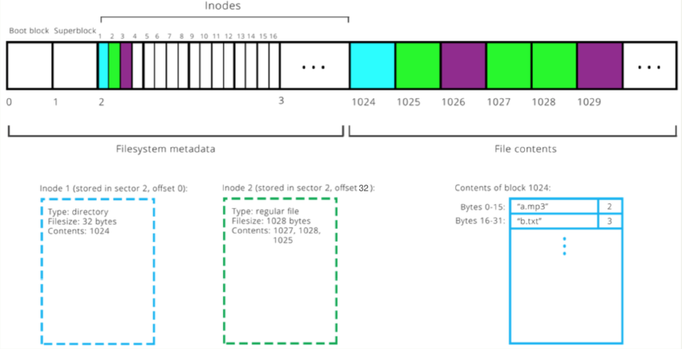
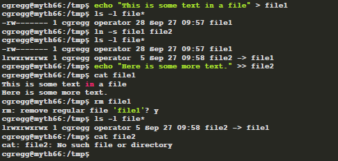
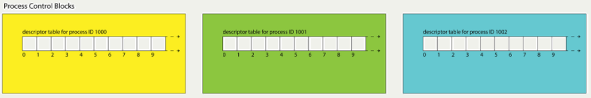
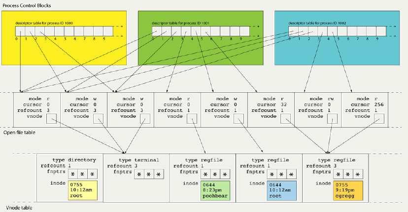
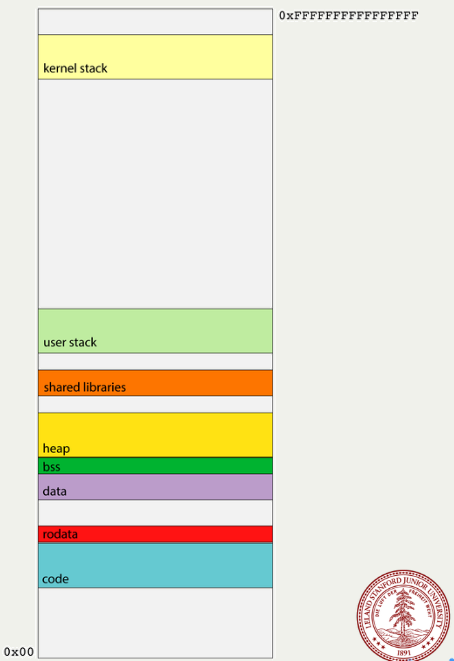
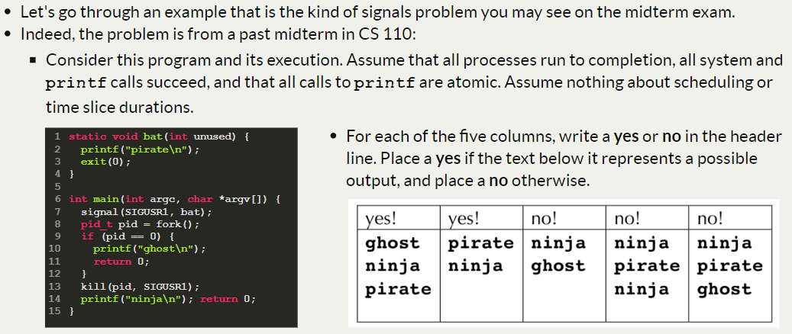
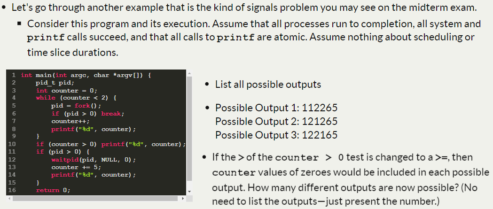
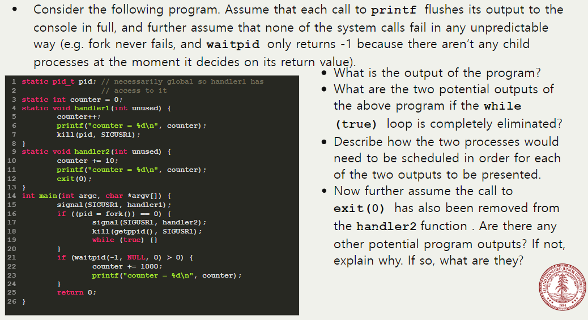

# Lecture 03: Layering, Naming, and Filesystem Design

Storage has its own divided layer called `sector` and filesystem has `block`. So multiple sectors can be bounded to one block.

## 1. Filesystem

The diagram below includes illustrations for a 32 byte (blue) and a 1028 (or 2 * 512 + 4) (green) byte
file


<p align = "center">
Fig.1 - filsystem
</p>

* The first block is the boot block, which typically contains information about the hard drive itself. It's
so named because its contents are generally tapped when booting

* The second block is the superblock, which contains information about the filesystem imposing itself
onto the hardware.

* The rest of the metadata region (at most
10%) stores the inode table, which at the highest level stores information
about each file stored somewhere within the filesystem.

* File payloads are stored in quantums of 512 bytes (or whatever the block size is).

## 2. Inode

`inodes` are data structures that store metainfo about a single file. Stored within an inode are items
like file owner, file permissions, creation times, and, most importantly for our purposes, file type, file
size, and the sequence of blocks enlisted to store payload. (So if you clear inode area, you cannot find your files)

32 bytes / inode -> 16 inodes / block


Each `directory` (one type of file) has its own inumber, and that inode directs contents, which contains path string and inumber (blue contents of [Fig.1 - filsystem]) - 14 bytes for filename string, 2 bytes for inumber. (so, in this os, we cannot make filename longer than 14 and actually ms dos was like this - 8 for name and 3 for extension)

What does the file lookup process look like, then? Consider a file at
'/usr/class/cs110/example.txt'. First, we find the inode for the file /(which always has
inumber 1. See [here](https://stackoverflow.com/questions/2099121/why-do-inode-numbers-start-from-1-and-not-0) about why it is 1 and not 0). We search inode 1's payload for the token 'usr' (linear search)
and its companion inumber. Let's say it's at inode 5. Then, we get inode 5's contents (which is
another directory) and search for the token class in the same way. From there, we look up the
token 'cs110' and then 'example.txt'. This will (finally) be an inode that designates a file, not a
directory.

## 3. Inode: Indirect addressing

Inodes can only store a maximum of 8 block numbers. This presumably
limits the total file size to 8 * 512 = 4096 bytes. That's way too small for any reasonably sized file.

To resolve this problem, we use a scheme called `indirect addressing`. Instead of block storing files, it stores inumbers(block numbers). In singly-indirect addressing, we could store up to 8 (actually 7) singly indirect block numbers in an inode, and each can store 512 /
2 = 256 block numbers. This increases the maximum file size to 8 * 256 * 512 = 1,048,576
bytes = 1 MB.

To make the max file size even bigger, Unix V6 uses the 8th block number of the inode
to store a doubly indirect block number. The total number of singly indirect block numbers we can have is 7 + 256 = 263, so the maximum file size
is 263 * 256 * 512 = 34,471,936 bytes = 34MB.

That's still not very large by today's standards, but remember we're referring to a file system design from
1975, when file system demands were lighter than they are today. In fact, because inumbers were only 16
bits, and block sizes were 512 bytes, the entire file system was limited to 32MB.

> Q.what's 'flag' to use indirect addressing?
> <br> > system looks at filesize (i_size0, i_size1) and if it's larger than 4096, flag is set.


## 4. Inode: Hard link and Soft link

Hard link (`ln <original-file> <new-file>`) increase original file's `i_nlink` in that inode. A file is removed from the
disk only when this reference count becomes 0, and when no
process is using the file (i.e., has it open). This means, for instance,
that rm filename can even remove a file when a program has it
open, and the program still has access to the file (because it
hasn't been removed from the disk). This is not true for many
other file systems (e.g., Windows)!


Soft link (`ln -s <original-file> <new-file>`) is a special file
that contains the path of another file, and has no reference to the inumber. Reference count for the original file
remains unchanged. If we delete the original file, the soft link
breaks! The soft link remains, but the path it
refers to is no longer valid. If we had
removed the soft link before the file, the
original file would still remain.




# Lecture 04: Files, Memory, and Processes


## 1. File Descriptor


Linux maintains a data structure for each active process. (Actually, linux handles all thing like 'file') These data structures are called `process control blocks`, and they are stored in the `process table`. Process control blocks store many things (the user who launched it, what time it was launched, CPU
state, etc.). Among the many items it stores is the `file descriptor table`. A `file descriptor` (used by your program) is a small integer that's an index into this table. It is the identifier needed to interact with a resource (most often a file) via
system calls. 



Descriptors 0, 1, and 2 are standard input, standard output, and standard error, but there are
no predefined meanings for descriptors 3 and up. When you run a program from the terminal,
descriptors 0, 1, and 2 are most often bound to the terminal.

When allocating a new file descriptor, kernel chooses the smallest available number. These semantics are important! If you close stdout (1) then open a file, it will be assigned
to file descriptor 1 so act as stdout (this is how $ cat in.txt > out.txt works)



If a descriptor table entry is in use, it maintains a link to an `open file table entry`. An open file table entry maintains information about an active session (current position) with a file (or something that behaves like a file like terminal, or a network connection).

`mode` tracks whether we're reading, writing, or both. `cursor` tracks a position within the file payload. `refcount` tracks the number of descriptors across all processes that refer to that session.

Each open file entry has a pointer to a `vnode`, which is a
structure housing static information about a file or filelike
resource. The vnode is the kernel's abstraction of an actual file: it includes information on what kind of file
it is, how many file table entries reference it, function pointers for performing operations, and copy of an inode from disk. A vnode's interface is filesystem independent, but its implementation is filesystem
specific; any file system (or file abstraction) can put state it needs to in the vnode (e.g., inode number)


## 2. System Calls

System calls are functions that our programs use to interact with the OS and request some core service be executed on their behalf:  open, read, write, close, stat, and lstat.

Functions like printf, malloc, and opendir aren't themselves system calls. They're C library functions that themselves rely on system calls to get their jobs done.

### Recap: memory area



* code segment stores all of the assembly code instructions specific to your process. 
* data segment intentionally rests directly on top of the code segment, and it houses all of the explicitly initialized global variables that can be modified by the program.
* heap is a software-managed segment used to support the implementation of malloc, realloc, free, and their C++ equivalents.
* user stack segment provides the memory needed to manage user function call and return along with the scratch space needed by function parameters and local variables.
* rodata segment also stores global variables, but only those which are immutable—i.e. constants.
* bss segment houses the uninitialized global variables, which are defaulted to be zero
* shared library segment links to shared libraries like libc and libstdc++ with code for routines like C's printf, C's malloc, or C++'s getline.

### kernel space

System calls like open and stat need access to OS implementation detail that should not be exposed or otherwise accessible to the user program. That means the activation records for system calls need to be stored in a region of memory that users can't touch, and the system call implementations need to be executed in a privileged, superuser mode so that it has access to information and resources that traditional functions shouldn't have.

Housed within kernel space is a kernel stack segment, itself used to organize stack frames for system calls.

We know that callq is used for user function call, but callq would dereference a function pointer we're not permitted to dereference, since it resides in kernel space. So, how user can call system function? 

The system issues a software interrupt (otherwise known as a trap) by executing `syscall`, which prompts an `interrupt handler` to execute in superuser mode.

The interrupt handler builds a frame in the kernel stack, executes the relevant code, places any return value in %rax\*, and then executes iretq to return from the interrupt handler, revert from superuser mode, and execute the instruction following the syscall.

\* The relevant opcode is placed in %rax. Each system call has its own opcode (e.g. 0 for read, 1 for write, 2 for open, 3 for close, 4 for stat, and so forth). If %rax is negative, errno is set to abs(%rax) and %rax is updated to contain a -1.


## 3. Introduction to Multiprocessing: fork

```c
#include <unistd.h>  // fork, getpid, getppid
pid_t pid = getpid();
```

The `fork()` system call creates a new process. It creates a new process that starts on the following instruction after the original, parent, process. The parent process also continues on the following instruction, as well. 

The fork call returns a pid_t (an integer) to both processes. The parent process gets a return value that is the pid of the child process. The child process gets a return value of 0, indicating that it is the child.

If parent process dies eariler than the child process, child's parent becomes root.

All memory is identical between the parent and child, though it is not shared (it is copied - copy on write).

### Example1
```c
int main(int argc, char *argv[]) {
  printf("Greetings from process %d! (parent %d)\n", getpid(), getppid());
  pid_t pid = fork();
  assert(pid >= 0);
  printf("Bye-bye from process %d! (parent %d)\n", getpid(), getppid());
  return 0;
}
```
```console
myth60$ ./basic-fork 
Greetings from process 29686! (parent 29351)
Bye-bye from process 29686! (parent 29351)
Bye-bye from process 29687! (parent 29686)

myth60$ ./basic-fork 
Greetings from process 29688! (parent 29351)
Bye-bye from process 29688! (parent 29351)
Bye-bye from process 29689! (parent 29688)
```

The original process has a parent, which is the shell (pid 29351) -- that is the program that you run in the terminal.

### Example2
```c
static const char const *kTrail = "abcd";
int main(int argc, char *argv[]) {
  size_t trailLength = strlen(kTrail);
  for (size_t i = 0; i < trailLength; i++) {
    printf("%c\n", kTrail[i]);
    pid_t pid = fork();
    assert(pid >= 0);
  }
  return 0;
}
```
```console
myth60$ ./fork-puzzle
a
b
b
c
d
c
d
c
d
d
c
d
myth60$ d 
d
d
```

Fork is used pervasively in applications. For example, the shell forks a new process to run the program. Fork is used pervasively in systems. For example, When your kernel boots, it starts the system.d program, which forks off all of the services and systems for your computer.

# Lecture 05: fork and Understanding execvp

## 1. fork (continued)

### Example3: remember it's virtual memory
```c
int main(int argc, char *argv[]) {
    char str[128];
    strcpy(str, "SpongeBob");
    printf("str's addres is %p\n", str);
    pid_t pid = fork();
    if (pid == 0) { // child
        printf("I am the child. str's address is %p\n", str);
        strcpy(str, "SquarePants");
        printf("I am the child and I changed str to %s. str's address is still %p\n", str, str);
    } else {
        printf("I am the parent. str's address is %p\n", str);
        printf("I am the parent, and I'm going to sleep for 2 seconds.\n");
        sleep(2);
        printf("I am the parent. I just woke up. str's address is %p, and it's value is %s\n", str, str);
    }

    return 0;
}
```
```console
$ ./fork-copy
str's addres is 0x7ffe092639d0
I am the parent. str's address is 0x7ffe092639d0
I am the parent, and I'm going to sleep for 2 seconds.
I am the child. str's address is 0x7ffe092639d0
I am the child and I changed str to SquarePants. str's address is still 0x7ffe092639d0
I am the parent. I just woke up. str's address is 0x7ffe092639d0, and it's value is SpongeBob
```
For both processes above, the pointer value is 0x7ffe092639d0. But, in physical memory, there has been a translation, so that there are actually two different memory locations.

### Example4: waitpid

waitpid can be used to temporarily block a process until a child process exits.
```c
pid_t waitpid(pid_t pid, int *status, int options);
```
return value is the pid of the child that exited, or -1 if waitpid was called and there were no child processes in the supplied wait set.
```c
int main(int argc, char *argv[]) {
  printf("Before.\n");
  pid_t pid = fork();
  printf("After.\n");
  if (pid == 0) {
    printf("I am the child, and the parent will wait up for me.\n");
    return 110; // contrived exit status
  } else {
    int status;
    waitpid(pid, &status, 0)
    if (WIFEXITED(status)) {
      printf("Child exited with status %d.\n", WEXITSTATUS(status));
    } else {
      printf("Child terminated abnormally.\n");
    }
    return 0;
  }
 }
 ```
 ```console
 myth60$ ./separate 
Before.
After.
After.
I am the child, and the parent will wait up for me.
Child exited with status 110.
myth60$
```

**The waitpid call also donates child process-oriented resources back to the system.** So you should use waitpid for every process using fork.

[See here](https://www.ibm.com/docs/en/zos/2.4.0?topic=functions-waitpid-wait-specific-child-process-end) for macros like `WIFEXITED`.

### Example5: it's virtual, but library is shared.

```c
int main(int argc, char *argv[]) {
    printf("I'm unique and just get printed once.\n");
    bool parent = fork() != 0;
    if ((random() % 2 == 0) == parent) sleep(1);
    if (parent) waitpid(pid, NULL, 0);
    printf("I get printed twice (this one is being printed from the %s).\n",
        parent ? "parent" : "child");
    return 0;
}
```
seems like `random()` could generate different value for each process but it's not. since `random` is sudo random function, parent and child has same return value for random and therefore only one of them sleep. (if you want different value, seed after fork.)

### Example6: multiple childs & ECHILD
```c
int main(int argc, char *argv[]) {
  for (size_t i = 0; i < 8; i++) {
    if (fork() == 0) exit(110 + i);
  } 
  while (true) {  // only master parent will do this
    int status;
    pid_t pid = waitpid(-1, &status, 0);
    if (pid == -1) { assert(errno == ECHILD); break; }
    if (WIFEXITED(status)) {
      printf("Child %d exited: status %d\n", pid, WEXITSTATUS(status));
    } else {
      printf("Child %d exited abnormally.\n", pid);
    }
  }
  return 0;
}
```
`pid == -1` just means that `waitpid` was unsuccessful. So we check errno. [See here](https://www.ibm.com/docs/en/zos/2.4.0?topic=functions-waitpid-wait-specific-child-process-end) for more information.

### Example7: synchronizing with waitpid
```c
int main(int argc, char *argv[]) {
  pid_t children[8];
  for (size_t i = 0; i < 8; i++) {
    if ((children[i] = fork()) == 0) exit(110 + i);
  }
  for (size_t i = 0; i < 8; i++) {
    int status;
    pid_t pid = waitpid(children[i], &status, 0);
    assert(pid == children[i]);
    assert(WIFEXITED(status) && (WEXITSTATUS(status) == (110 + i)));
    printf("Child with pid %d accounted for (return status of %d).\n", 
           children[i], WEXITSTATUS(status));
  }
  return 0;
}
```
```console
myth60$ ./reap-as-they-exit 
Child with pid 4689 accounted for (return status of 110).
Child with pid 4690 accounted for (return status of 111).
Child with pid 4691 accounted for (return status of 112).
Child with pid 4692 accounted for (return status of 113).
Child with pid 4693 accounted for (return status of 114).
Child with pid 4694 accounted for (return status of 115).
Child with pid 4695 accounted for (return status of 116).
Child with pid 4696 accounted for (return status of 117).
myth60$
```

## execvp

execvp systemcall effectively reboots a process to run a different program from scratch. Here is the prototype:
```c
int execvp(const char *path, char *argv[]);
```
If execvp fails to cannibalize the process and install a new executable image within it, it returns -1 to express failure. If execvp succeeds, it never returns in the calling process. 

Actually, there are several functions starting with exec (execl, execv, execle, execve, execlp, execvp).
* l: pass argv with char *
* v: pass argv with char *[]
* e: pass environment variable with char *[]
* p: pass path name of the new process image file

### Example
```c
static int mysystem(const char *command) {
  pid_t pid = fork();
  if (pid == 0) {
    char *arguments[] = {"/bin/sh", "-c", (char *) command, NULL};
    execvp(arguments[0], arguments);
    // if execvp succeed, this line will never be read.
    printf("Failed to invoke /bin/sh to execute the supplied command.");
    exit(0);
  }
  int status;
  waitpid(pid, &status, 0);
  return WIFEXITED(status) ? WEXITSTATUS(status) : -WTERMSIG(status);
}

static const size_t kMaxLine = 2048;
int main(int argc, char *argv[]) {
  char command[kMaxLine];
  while (true) {
    printf("> ");
    fgets(command, kMaxLine, stdin);
    if (feof(stdin)) break; 
    command[strlen(command) - 1] = '\0'; // overwrite '\n'
    printf("retcode = %d\n", mysystem(command));
  }
  
  printf("\n");
  return 0;
}
```
Why not call execvp inside parent and forgo the child process altogether? Because
execvp would consume the calling process(what 'cannibalize' means above), and that's not what we want.

\* fgets is a somewhat overflow-safe variant on scanf that knows to read everything up through and including the newline character.


# Lecture 06: execvp, Pipes, and Interprocess Communication

## 1. Simple shell using execvp

Let's work through the implementation of a more sophisticated shell: the simplesh. simplesh operates as a read-eval-print loop (`repl`) which itself responds to the many things we type in by forking off child processes.

Advanced from the example from last lecture, it needs to implement this feature of the shell:
```console
myth$ cat <<EOF | tee ./annoying.sh
while [ 1 ]; do echo "are you annoyed yes?"; sleep 1; done
EOF

myth$ ./annoying.sh
myth$ <!-- make the process background -->
myth$ ^z
myth$ bg
myth$ <!-- make the process foreground -->
myth$ fg
myth$ ^c
```
or,
```bash
myth$ <!-- & makes it background -->
myth$ while [ 1 ]; do echo "are you annoyed yes?"; sleep 1; done &
myth$ 
myth$ fg
myth$ ^c
```
Implementation of simplesh is presented below. Where helper functions don't rely on CS110 concepts, omitted their implementations. (not all features of above are presented.)

```c
int main(int argc, char *argv[]) {
  while (true) {
    char command[kMaxCommandLength + 1];
    readCommand(command, kMaxCommandLength);
    char *arguments[kMaxArgumentCount + 1];
    int count = parseCommandLine(command, arguments, kMaxArgumentCount);
    if (count == 0) continue;
    if (strcmp(arguments[0], "quit") ==) break; // hardcoded builtin to exit shell
    bool isbg = strcmp(arguments[count - 1], "&") == 0;
    if (isbg) arguments[--count] = NULL; // overwrite "&"
    pid_t pid = fork();
    if (pid == 0) execvp(arguments[0], arguments);
    if (isbg) { // background process, don't wait for child to finish
      printf("%d %s\n", pid, command);
    } else {    // otherwise block until child process is complete
      waitpid(pid, NULL, 0);
    }
  }
  printf("\n");
  return 0;
}
```
<p align="center">
Code 1: simple shell - bg
</p>

## 2. pipe: ipc

```c
int pipe(int fds[]);
```

The pipe system call takes an uninitialized array of two integers—let’s call it fds—and populates it with two file descriptors such that everything written to `fds[1]` can be read from `fds[0]`.

pipe is particularly useful for allowing parent processes to communicate with spawned child processes. That's because the file descriptor table of the parent is cloned, and that clone is installed in the child. That means the open file table entries references by the parent's pipe endpoints are also referenced by the child's copies of them.

### Example

```c
int main(int argc, char *argv[]) {
  int fds[2];  // 0 is reader, 1 is writer. (remember opcode)
  pipe(fds);  // makes a new pipe.
  pid_t pid = fork();
  if (pid == 0) {  // child
    close(fds[1]);  // since child will read, close writer for child.
    char buffer[6];
    read(fds[0], buffer, sizeof(buffer));  // read blocks until read. (continues if input file ended - so close file in parent! - but even if you forgot, system will take care of that.)
    printf("Read from pipe bridging processes: %s.\n", buffer);
    close(fds[0]);
    return 0;
  }
  close(fds[0]);  // since parent will write, close reader for parent.
  write(fds[1], "hello", 6);
  waitpid(pid, NULL, 0);  // should wait until child reader finish.
  close(fds[1]);
  return 0;
}
```

## 3. dup2

The dup system call creates a copy of a file descriptor.
```c
int dup(int oldfd);
int dup2(int oldfd, int newfd);
```
dup works like
```c
int copy_desc = dup(file_desc);
```
while dup2 works like
```c
dup2(file_desc, 1); 
```
The dup2() system call is similar to dup() but the basic difference between them is that instead of using the lowest-numbered unused file descriptor, it uses the descriptor number specified by the user. If the descriptor newfd was previously open, it is silently closed before being reused.

### Example: subprocess

Rather than waiting for command to finish, subprocess returns a subprocess_t with the command process’s pid and a single descriptor called supplyfd. By design, arbitrary text can be published to the return value’s supplyfd field with the understanding that that same data can be ingested verbatim by the child's stdin.
```c
typedef struct {
  pid_t pid;
  int supplyfd;
} subprocess_t;
subprocess_t subprocess(const char *command);

subprocess_t subprocess(const char *command) {
  int fds[2];
  pipe(fds);
  subprocess_t process = { fork(), fds[1] };
  if (process.pid == 0) { // child
    close(fds[1]); // no writing necessary
    dup2(fds[0], STDIN_FILENO);  // injected words can be read with STDIN in child
    close(fds[0]); // already duplicated to STDIN_FILENO.
    char *argv[] = {"/bin/sh", "-c", (char *) command, NULL};
    execvp(argv[0], argv);
  }
  close(fds[0]); // no reading from parent
  return process;
}

int main(int argc, char *argv[]) {
  subprocess_t sp = subprocess("/usr/bin/sort");  // sort will print to STDOUT
  const char *words[] = {
    "felicity", "umbrage", "susurration", "halcyon", 
    "pulchritude", "ablution", "somnolent", "indefatigable"
  };
  for (size_t i = 0; i < sizeof(words)/sizeof(words[0]); i++) {
    dprintf(sp.supplyfd, "%s\n", words[i]);  // inject words to writer from parent
  }
  close(sp.supplyfd);  // this is important. if not closed, sort process will wait forever.
  int status;
  pid_t pid = waitpid(sp.pid, &status, 0);
  return pid == sp.pid && WIFEXITED(status) ? WEXITSTATUS(status) : -127;
}
```
```console
cgregg@myth60$ ./subprocess 
ablution
felicity
halcyon
indefatigable
pulchritude
somnolent
susurration
umbrage
cgregg@myth60$
```

And that's how something like `cat unsorted.txt | sort` works.

# Lecture 07: Signals

## 1. Signals

A `signal` is a small message that notifies a process that an event of some type occurred. Signals are often sent by the kernel, but they can be sent from other processes as well.

`signal handler` is a function that executes in response to the arrival and consumption of a signal. The signal handler runs in the process that receives the signal.

### Signal Examples

You haven't truly programmed in C before unless you've unintentionally dereferenced a NULL pointer. When that happens, the kernel delivers a signal of type `SIGSEGV`, informally known as a segmentation fault (or a SEGmentation Violation, or SIGSEGV, for short). Unless you install a custom signal handler to manage the signal differently, a SIGSEGV terminates the program and generates a core dump.

Whenever a process commits an integer-divide-by-zero (and, in some cases, a floating-point divide by zero on older architectures), the kernel hollers and issues a `SIGFPE` signal to the offending process. By default, the program handles the SIGFPE by printing an error message announcing the zero denominator and generating a core dump.

When you type ctrl-c, the kernel sends a `SIGINT` to the foreground process (and by default, that foreground is terminated).

When you type ctrl-z, the kernel issues a `SIGTSTP` to the foreground process (and by default, the foreground process is halted until a subsequent `SIGCONT` signal instructs it to continue).

When a process attempts to publish data to the write end of a pipe after the read end has been closed, the kernel delivers a `SIGPIPE` to the offending process. The default SIGPIPE handler prints a message identifying the pipe error and terminates the program.

Whenever a child process changes state—that is, it exits, crashes, stops, or resumes from a stopped state, the kernel sends a `SIGCHLD` signal to the process's parent. By default, the signal is ignored. In fact, we've ignored it until right now and gotten away with it. The parent process, however, is still required to reap child processes, so the parent will typically register a custom SIGCHLD handler to be asynchronously invoked whenever a child process changes state. Custom SIGCHLD handlers almost always include calls to waitpid, which can be used to surface the pids of child processes that've changed state. If the child process of interest actually terminated, either normally or abnormally, the waitpid also culls the zombie the relevant child process has become.


### Example: DisneyLand

```c
#include <signal.h>     // for signal

static const size_t kNumChildren = 5;
static size_t numDone = 0;

static void reapChild(int unused) {
  waitpid(-1, NULL, 0);
  numDone++;
  printf("numDone: %zu", numDone);
}

int main(int argc, char *argv[]) {
  printf("Let my five children play while I take a nap.\n");
  // if some SIGCHLD, readpChild is evoked.
  signal(SIGCHLD, reapChild); 
  for (size_t kid = 1; kid <= 5; kid++) {
    if (fork() == 0) {
      sleep(3 * kid); // sleep emulates "play" time
      printf("Child #%zu tired... returns to dad.\n", kid);
      return 0;
    }
  }
  while (numDone < kNumChildren) {
    printf("At least one child still playing, so dad nods off.\n");
    snooze(5); // our implementation -- does not wake up upon signal
    printf("Dad wakes up! ");
  }
  printf("All children accounted for.  Good job, dad!\n");
  return 0;
}
```
```console
cgregg@myth60$ ./five-children 
Let my five children play while I take a nap.
At least one child still playing, so dad nods off.
Child #1 tired... returns to dad.
Dad wakes up! At least one child still playing, so dad nods off.
Child #2 tired... returns to dad.
Child #3 tired... returns to dad.
Dad wakes up! At least one child still playing, so dad nods off.
Child #4 tired... returns to dad.
Child #5 tired... returns to dad.
Dad wakes up! All children accounted for.  Good job, dad!
cgregg@myth60$
```

if `sleep(3 * kid);` changed to `sleep(3)`, kernel race condition arises. And if multiple signals come in at the same time, the signal handler is only run once. Although there's little chance of all children process finish somewhat different time so signal handler called five times, most cases less than that. So, in that case, we could modify signal handler as follows:
```c
static void reapChild(int unused) {
  while (true) {
    pid_t pid = waitpid(-1, NULL, 0);
    // A return value of -1 typically means that there are no child processes left.
    if (pid < 0) break;
    numDone++;
  }
}
```
but then, if it is `sleep(3 * kid);`, dad doesn't wake up (until all children finishes) because signal handler is on the parent process and once it's evoked, another line of code cannot be executed until the signal handler returns. Signal handlers and the asynchronous interrupts that come with them mean that your normal execution flow can, in general, be interrupted at any time to handle signals.

Finally it becomes:
```c
static void reapChild(int unused) {
  while (true) {
    pid_t pid = waitpid(-1, NULL, WNOHANG);
    if (pid <= 0) break; // note the < is now a <=
    numDone++;
  }
}
```
A return value by waitpid of 0 means there are other child processes, and we would have normally waited for them to exit, but we’re returning instead because of the `WNOHANG` being passed in as the third argument.

The third argument supplied to waitpid can include several flags bitwise-or'ed together. [see here](https://stackoverflow.com/questions/33508997/waitpid-wnohang-wuntraced-how-do-i-use-these) for more information.

* 0 - wait on a child to be ended
* `WUNTRACED` - also wait on a child to be stopped (paused).
* `WCONTINUED` - also wait on a child to be continued (resumed).
* `WNOHANG` - don't block
* `WUNTRACED | WCONTINUED | WNOHANG` asks that waitpid return information about a child process that has changed state (i.e. exited, crashed, stopped, or continued) but to do so without blocking.

## 2. Masking Signals and Deferring Handlers

### Example: job list

```c
static void reapProcesses(int sig) {
  while (true) {
    pid_t pid = waitpid(-1, NULL, WNOHANG);
    if (pid <= 0) break;
    printf("Job %d removed from job list.\n", pid);
  }
}

char * const kArguments[] = {"date", NULL};
int main(int argc, char *argv[]) {
  signal(SIGCHLD, reapProcesses);
  for (size_t i = 0; i < 3; i++) {
    pid_t pid = fork();
    if (pid == 0) execvp(kArguments[0], kArguments);
    sleep(1); // force parent off CPU
    printf("Job %d added to job list.\n", pid);
  }
  return 0;
}
```

```console
myth60$ ./job-list-broken
Sun Jan 27 03:57:30 PDT 2019
Job 27981 removed from job list.
Job 27981 added to job list.
Sun Jan 27 03:57:31 PDT 2019
Job 27982 removed from job list.
Job 27982 added to job list.
Sun Jan 27 03:57:32 PDT 2019
Job 27985 removed from job list.
Job 27985 added to job list.
myth60$ ./job-list-broken
Sun Jan 27 03:59:33 PDT 2019
Job 28380 removed from job list.
Job 28380 added to job list.
Sun Jan 27 03:59:34 PDT 2019
Job 28381 removed from job list.
Job 28381 added to job list.
Sun Jan 27 03:59:35 PDT 2019
Job 28382 removed from job list.
Job 28382 added to job list.
myth60$
```
Even if the `sleep(1)` is removed, it's possible that the child executes date, exits, and forces the parent to execute its SIGCHLD handler before the parent gets to its own printf. The fact that it's possible means we have a concurrency issue.

We need some way to block reapProcesses from running until it's safe or sensible to do so. Restated, we'd like to postpone reapProcesses from executing until the parent's printf has returned.

The kernel provides directives that allow a process to temporarily ignore signal delivery. The subset of directives that interest us are presented below:
```c
int sigemptyset(sigset_t *set);
int sigaddset(sigset_t *additions, int signum);
int sigprocmask(int op, const sigset_t *delta, sigset_t *existing);
```

* `sigset_t` type is a small primitive—usually a 32-bit, unsigned integer—that's used as a bit vector of length 32. Since there are just under 32 signal types, the presence or absence of signums can be captured via an ordered collection of 0's and 1's.
* `sigemptyset` is used to initialize the sigset_t at the supplied address to be the empty set of signals. We generally ignore the return value.
* `sigaddset` is used to ensure the supplied signal number, if not already present, gets added to the set addressed by additions. Again, we generally ignore the return value.
* `sigprocmask` adds (if op is set to SIG_BLOCK) or removes (if op is set to SIG_UNBLOCK) the signals reachable from delta to/from the set of signals being ignored at the moment. The third argument is the location of a sigset_t that can be updated with the set of signals being blocked at the time of the call. Again, we generally ignore the return value.

```c
// imposes a block on SIGCHLDs:
static void imposeSIGCHLDBlock() {
  sigset_t set;
  sigemptyset(&set);
  sigaddset(&set, SIGCHLD);
  sigprocmask(SIG_BLOCK, &set, NULL);
}
// lifts the block on the signals packaged within the supplied vector:
static void liftSignalBlocks(const vector<int>& signums) {
  sigset_t set;
  sigemptyset(&set);
  for (int signum: signums) sigaddset(&set, signum);
  sigprocmask(SIG_UNBLOCK, &set, NULL);
}
```

The example code becomes:
```c
// job-list-fixed.c
char * const kArguments[] = {"date", NULL};
int main(int argc, char *argv[]) {
  signal(SIGCHLD, reapProcesses);
  sigset_t set;
  sigemptyset(&set);
  sigaddset(&set, SIGCHLD);
  for (size_t i = 0; i < 3; i++) {
    sigprocmask(SIG_BLOCK, &set, NULL);
    pid_t pid = fork();
    if (pid == 0) {
      sigprocmask(SIG_UNBLOCK, &set, NULL); // if not and if execvp called a process with child process, it becomes problem.
      execvp(kArguments[0], kArguments);
    }
    sleep(1); // force parent off CPU
    printf("Job %d added to job list.\n", pid);
    sigprocmask(SIG_UNBLOCK, &set, NULL); // now unblock child in parent.
  }
  return 0;
}
```
```console
myth60$ ./job-list-fixed
Sun Jan 27 05:16:54 PDT 2019
Job 3522 added to job list.
Job 3522 removed from job list.
Sun Jan 27 05:16:55 PDT 2019
Job 3524 added to job list.
Job 3524 removed from job list.
Sun Jan 27 05:16:56 PDT 2019
Job 3527 added to job list.
Job 3527 removed from job list.
myth60$ ./job-list-fixed
Sun Jan 27 05:17:15 PDT 2018
Job 4677 added to job list.
Job 4677 removed from job list.
Sun Jan 27 05:17:16 PDT 2018
Job 4691 added to job list.
Job 4691 removed from job list.
Sun Jan 27 05:17:17 PDT 2018
Job 4692 added to job list.
Job 4692 removed from job list.
myth60$
```
date runs and finishes, so SIGCHLD arise but it's blocked so reapProcesses is blocked. printf in parent returns, and parent unblocks SIGCHLD so printf in reapProcesses returns.


## 3. kill and raise

Processes can message other processes using signals via the kill system call. And processes can even send themselves signals using raise.

```c
int kill(pid_t pid, int signum);
int raise(int signum); // equivalent to kill(getpid(), signum);
```

Unlike the name, it just sends message. So named, because the default action of most signals in early UNIX implementations was to just terminate the target process. (using SIGKILL)


# Lecture 08: Race Conditions, Deadlock, and Data Integrity


## 1. Simple shell (revisited)

In [Code 1: simple shell - bg], we can see that background processes are left as zombies for the lifetime of the shell.

```c
static pid_t fgpid = 0; // global, intially 0, and 0 means no foreground process           
static void reapProcesses(int sig) {
  while (true) {
    pid_t pid = waitpid(-1, NULL, WNOHANG);
    if (pid <= 0) break;
    if (pid == fgpid) fgpid = 0; // clear foreground process
  }
}

static void waitForForegroundProcess(pid_t pid) {
  fgpid = pid;
  while (fgpid == pid) {;}
}

int main(int argc, char *argv[]) {
  signal(SIGCHLD, reapProcesses);
  while (true) {
    // code to initialize command, argv, and isbg omitted for brevity

    pid_t pid = fork();
    if (pid == 0) execvp(arguments[0], arguments);
    if (isbg) { // background process, don't wait for child to finish
      printf("%d %s\n", pid, command);
    } else {    // otherwise block until child process is complete
      waitForForegroundProcess(pid);
    }
  }
  printf("\n");
  return 0;
}
```

* Notice that `waitpid` command in forground process is changed too. When the SIGCHLD handler exits, normal execution resumes, and the original call to waitpid returns -1 to state that there is no trace of a process with the supplied pid. The waitpid call is redundant and replicates functionality better managed in the SIGCHLD handler. So it's changed because we should only be calling waitpid in one place: the SIGCHLD handler.

* Now waitpid for all process will be evoked so there will be no zombie process. But some problems left:
  * It's possible the foreground process finishes and reapProcesses is invoked on its behalf before normal execution flow updates fgpid. If that happens, the shell will spin forever and never advance up to the shell prompt. This is a race condition, and race conditions are no-nos.
  * The while (fgpid == pid) {;} is also a no-no. This allows the shell to spin on the CPU even when it can't do any meaningful work. It would be substantially better for simplesh to yield the CPU and to only be considered for CPU time when there's a chance the foreground process has exited.

The race condition can be cured by blocking SIGCHLD before forking, and only lifting that block after the global fgpid has been set.
```c
static void toggleSIGCHLDBlock(int how) {
  sigset_t mask;
  sigemptyset(&mask);
  sigaddset(&mask, SIGCHLD);
  sigprocmask(how, &mask, NULL);
}

void blockSIGCHLD() {
  toggleSIGCHLDBlock(SIG_BLOCK);
}

void unblockSIGCHLD() {
  toggleSIGCHLDBlock(SIG_UNBLOCK);
}

static void waitForForegroundProcess(pid_t pid) {
  fgpid = pid;
  unblockSIGCHLD(); // lift only after fgpid has been set
  while (fgpid == pid) {;}
}

int main(int argc, char *argv[]) {
  signal(SIGCHLD, reapProcesses);
  while (true) {
    // code to initialize command, argv, and isbg omitted for brevity                                                                                        
    blockSIGCHLD();
    pid_t pid = fork();
    if (pid == 0) { 
      unblockSIGCHLD(); 
      execvp(argv[0], argv); 
    }
    if (isbg) {
      printf("%d %s\n", pid, command);
      unblockSIGCHLD();
    } else {
      waitForForegroundProcess(pid);                   
    }
  }
}

```
So how we solve the CPU spin issue? One might do like `while (fgpid == pid) {usleep(100000);}` but we'd really prefer to keep the shell off the CPU until the OS has some information suggesting the foreground process is done.

The C libraries provide a `pause` function, which forces the process to sleep until some unblocked signal arrives. This sounds promising, because we know fgpid can only be changed because a SIGCHLD signal comes in and reapProcesses is executed.

```c
// deadlock
static void waitForForegroundProcess(pid_t pid) {
  fgpid = pid;
  unblockSIGCHLD();
  while (fgpid == pid) {
    pause();
  }
}
```
The problem here? `SIGCHLD` may arrive after `fgpid == pid` evaluates to true but before the call to `pause` it's committed to. That would be unfortunate, because it's possible simplesh isn't managing any other processes, which means that no other signals, much less SIGCHLD signals, will arrive to lift simplesh out of its pause call. That would leave simplesh in a state of deadlock. (pause is waiting for the process signal, process is waiting for the pause to return)

One might think unblock and block might help.
```c               
// deadlock                                                        
static void waitForForegroundProcess(pid_t pid) {
  fgpid = pid;
  while (fgpid == pid) {
    unblockSIGCHLD();
    pause();
    blockSIGCHLD();
  }
  unblockSIGCHLD();
}
```
but this has the same problem.

The main problem with both versions is that each lifts the block on SIGCHLD before going to sleep via pause.

The solution is to rely on a more specialized version of pause called `sigsuspend`, which asks that the OS change the blocked set to the one provided, but only after the caller has been forced off the CPU. When some unblocked signal arrives, the process gets the CPU, the signal is handled, the original blocked set is restored, and sigsuspend returns. [description](https://man7.org/linux/man-pages/man2/sigsuspend.2.html)
```c
static void waitForForegroundProcess(pid_t pid) {
  fgpid = pid;
  sigset_t empty;
  sigemptyset(&empty);  // no block
  while (fgpid == pid) {
    sigsuspend(&empty);  // SIGCHLD is already blocked, so this means we push `pause` to the cpu first, then unblock the SIGCHLD. if pause finishes, it blocks SIGCHLD again.
  }
  unblockSIGCHLD();
}
```

## 2. Example Problem


for third one, if parent process already printed ninja, kill syscall has sent signal to the child. Assume that if that signal was slow, and child could print ghost. But then, signal handler must print pirate.



easy if you draw a diagram.



this one's even easier.
```console
counter = 1
counter = 10
counter = 1001
```
```console
counter = 1
counter = 1001
```
no.

