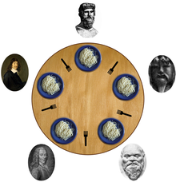

# Lecture 09: Introduction to Threads

A thread is an independent execution sequence within a single process. Operating systems and programming languages generally allow processes to run two or more functions simultaneously via threading.

The stack segment is subdivided into multiple miniature stacks, one for each thread. The thread manager time slices and switches between threads in much the same way that the OS scheduler switches between processes. In fact, threads are often called lightweight processes.

Each thread maintains its own stack, but all threads share the same text, data, and heap segments. It's easier to support communication between threads, because they run in the same virtual address space. But there's no memory protection, since virtual address space is shared. Race conditions and deadlock threats need to be mitigated, and debugging can be difficult. Many bugs are hard to reproduce, since thread scheduling isn't predictable.

ANSI C doesn't provide native support for threads. But `pthreads`, which comes with all standard UNIX and Linux installations of gcc, provides thread support, along with other related concurrency directives.

The primary `pthreads` data type is the `pthread_t`, which is an opaque type used to manage the execution of a function within its own thread of execution.
The only pthreads functions we'll need (before formally transitioning to C++ threads) are `pthread_create` and `pthread_join` (similar to waitpid). [man - pthread_create](https://man7.org/linux/man-pages/man3/pthread_create.3.html) / [man - pthread_join](https://man7.org/linux/man-pages/man3/pthread_join.3.html)

```c
static void *recharge(void *args) {
    printf("I recharge by spending time alone.\n");
    return NULL;
}

static const size_t kNumIntroverts = 6;
int main(int argc, char *argv[]) {
    printf("Let's hear from %zu introverts.\n", kNumIntroverts);
    pthread_t introverts[kNumIntroverts];
    for (size_t i = 0; i < kNumIntroverts; i++)
        pthread_create(&introverts[i], NULL, recharge, NULL);
    for (size_t i = 0; i < kNumIntroverts; i++)
        pthread_join(introverts[i], NULL);
    printf("Everyone's recharged!\n");
    return 0;
}
```
```console
cgregg@myth57$ ./recharge
Let's hear from 6 introverts.
I recharge by spending time alone.
I recharge by spending time alone.
I recharge by spending time alone.
I recharge by spending time alone.
I recharge by spending time alone.
I recharge by spending time alone.
Everyone's recharged!
cgregg@myth57$
```
```c
static const char *kFriends[] = {
    "Jack", "Michaela", "Luis", "Richard", "Jordan", "Lisa",
    "Imaginary"
};
static const size_t kNumFriends = sizeof(kFriends)/sizeof(kFriends[0]) - 1; // count excludes imaginary friend!

static void *meetup(void *args) {
    const char *name = kFriends[*(size_t *)args];
    printf("Hey, I'm %s.  Empowered to meet you.\n", name);
    return NULL;
}

int main() {
    printf("Let's hear from %zu friends.\n", kNumFriends);
    pthread_t friends[kNumFriends];
    for (size_t i = 0; i < kNumFriends; i++)
        pthread_create(&friends[i], NULL, meetup, &i);
    for (size_t j = 0; j < kNumFriends; j++)
        pthread_join(friends[j], NULL);
    printf("Is everyone accounted for?\n");
    return 0;
}
```
```console
cgregg@myth57$ ./confused-friends
Let's hear from 6 friends.
Hey, I'm Jordan.  Empowered to meet you.
Hey, I'm Lisa.  Empowered to meet you.
Hey, I'm Jordan.  Empowered to meet you.
Hey, I'm Imaginary.  Empowered to meet you.
Hey, I'm Jordan.  Empowered to meet you.
Hey, I'm Imaginary.  Empowered to meet you.
Is everyone accounted for?
cgregg@myth57$ ./confused-friends
Let's hear from 6 friends.
Hey, I'm Richard.  Empowered to meet you.
Hey, I'm Richard.  Empowered to meet you.
Hey, I'm Richard.  Empowered to meet you.
Hey, I'm Jordan.  Empowered to meet you.
Hey, I'm Lisa.  Empowered to meet you.
Hey, I'm Imaginary.  Empowered to meet you.
Is everyone accounted for?
cgregg@myth57$ ./confused-friends
Let's hear from 6 friends.
Hey, I'm Jordan.  Empowered to meet you.
Hey, I'm Lisa.  Empowered to meet you.
Hey, I'm Imaginary.  Empowered to meet you.
Hey, I'm Imaginary.  Empowered to meet you.
Hey, I'm Imaginary.  Empowered to meet you.
Hey, I'm Imaginary.  Empowered to meet you.
Is everyone accounted for?
cgregg@myth57$
```
So.. why?

Reason is that `&i` is not changed during `pthread_create` and value is changing. Fortunately, the fix is simple

```c
static const char *kFriends[] = {
  "Jack", "Michaela", "Luis", "Richard", "Jordan", "Lisa",
  "Imaginary"
};

static const size_t kNumFriends = sizeof(kFriends)/sizeof(kFriends[0]) - 1; // count excludes imaginary friend!

static void *meetup(void *args) {
  const char *name = args;
  printf("Hey, I'm %s.  Empowered to meet you.\n", name);
  return NULL;
}

int main() {
  printf("%zu friends meet.\n", kNumFriends);
  pthread_t friends[kNumFriends];
  for (size_t i = 0; i < kNumFriends; i++)
    pthread_create(&friends[i], NULL, meetup, (void *) kFriends[i]); // this line is different than before, too
  for (size_t i = 0; i < kNumFriends; i++)
    pthread_join(friends[i], NULL);
  printf("All friends are real!\n");
  return 0;
}
```
```console
cgregg@myth57$ ./friends
6 friends meet.
Hey, I'm Jack.  Empowered to meet you.
Hey, I'm Michaela.  Empowered to meet you.
Hey, I'm Luis.  Empowered to meet you.
Hey, I'm Richard.  Empowered to meet you.
Hey, I'm Jordan.  Empowered to meet you.
Hey, I'm Lisa.  Empowered to meet you.
All friends are real!
cgregg@myth57$ ./friends
6 friends meet.
Hey, I'm Jack.  Empowered to meet you.
Hey, I'm Luis.  Empowered to meet you.
Hey, I'm Michaela.  Empowered to meet you.
Hey, I'm Richard.  Empowered to meet you.
Hey, I'm Jordan.  Empowered to meet you.
Hey, I'm Lisa.  Empowered to meet you.
All friends are real!
cgregg@myth57$ ./friends
6 friends meet.
Hey, I'm Jack.  Empowered to meet you.
Hey, I'm Michaela.  Empowered to meet you.
Hey, I'm Richard.  Empowered to meet you.
Hey, I'm Jordan.  Empowered to meet you.
Hey, I'm Luis.  Empowered to meet you.
Hey, I'm Lisa.  Empowered to meet you.
All friends are real!
cgregg@myth57$
```

# Lecture 10: From C threads to C++ threads

Rather than deal with pthreads as a platform-specific extension of C, I'd rather use a thread package that's officially integrated into the language itself. As of 2011, C++ provides support for [threading](https://en.cppreference.com/w/cpp/thread/thread) and many synchronization directives.

see [here](https://gist.github.com/Wallace-dyfq/2817479ce0309791e52cd11012116849) for ostreamlock (it used mutex) - used it since operator<<, unlike printf, isn't thread-safe.

```cpp
#include <iostream>
#include <thread>
#include "ostreamlock.h"  // oslock, osunlock

static void recharge() {
    cout << oslock << "I recharge by spending time alone." << endl << osunlock; 
}
    
static const size_t kNumIntroverts = 6;
int main(int argc, char *argv[]) {
  cout << "Let's hear from " << kNumIntroverts << " introverts." << endl   ;   
  thread introverts[kNumIntroverts]; // declare array of empty thread handles
  for (thread& introvert: introverts)
     introvert = thread(recharge);    // move anonymous threads into empty handles
  for (thread& introvert: introverts)
     introvert.join();    
  cout << "Everyone's recharged!" << endl;
  return 0;
}
```

note that thread has been created and fully transplanted to the contents of the thread on the left side. (the left and right thread objects are effectively swapped.) This is an important distinction, because a traditional operator= would produce a second working copy of the same thread, and we don't want that.


Thread routines can accept any number of arguments using variable argument lists. (see [constructor of thread](https://en.cppreference.com/w/cpp/thread/thread/thread))

```cpp
static void greet(size_t id) {
  for (size_t i = 0; i < id; i++) {
    cout << oslock << "Greeter #" << id << " says 'Hello!'" << endl << osunlock;
    struct timespec ts = {
      0, random() % 1000000000
    };
    nanosleep(&ts, NULL);
  }
  cout << oslock << "Greeter #" << id << " has issued all of his hellos, " 
       << "so he goes home!" << endl << osunlock;
}

static const size_t kNumGreeters = 6;
int main(int argc, char *argv[]) {
  cout << "Welcome to Greetland!" << endl;
  thread greeters[kNumGreeters];
  for (size_t i = 0; i < kNumGreeters; i++) greeters[i] = thread(greet, i + 1);
  for (thread& greeter: greeters) greeter.join();
  cout << "Everyone's all greeted out!" << endl;
  return 0;
}

```

* Thread is not well mixed with Process. Thread has it's own id, but not like pid. Generally we don't join another thread inside a thread. We don't fork inside a thread. Maybe you can generate thread inside some child processes.

### Example: Airline

Consider the scenario where 10 ticket agents answer telephones at United Airlines to jointly sell 250 airline tickets. Each ticket agent answers the telephone, and each telephone call always leads to the sale of precisely one ticket. 

Rather than requiring each ticket agent sell 10% of the tickets, we'll account for the possibility that some ticket sales are more time consuming than others, some ticket agents need more time in between calls, etc. Instead, we'll require that all ticket agents keep answering calls and selling tickets until all have been sold.

First attempt is like this:
```cc
static void ticketAgent(size_t id, size_t& remainingTickets) {
  while (remainingTickets > 0) {
    handleCall(); // sleep for a small amount of time to emulate conversation time.
    remainingTickets--;  // this is not atomic
    cout << oslock << "Agent #" << id << " sold a ticket! (" << remainingTickets 
     << " more to be sold)." << endl << osunlock;
    if (shouldTakeBreak()) // flip a biased coin
      takeBreak();         // if comes up heads, sleep for a random time to take a break
  }
  cout << oslock << "Agent #" << id << " notices all tickets are sold, and goes home!" 
       << endl << osunlock;
}

int main(int argc, const char *argv[]) {
  thread agents[10];
  size_t remainingTickets = 250;
  for (size_t i = 0; i < 10; i++)
    agents[i] = thread(ticketAgent, 101 + i, ref(remainingTickets));
  for (thread& agent: agents) agent.join();
  cout << "End of Business Day!" << endl;
  return 0;
}
```
```console
cgregg@myth55$ ./confused-ticket-agents 
Agent #110 sold a ticket! (249 more to be sold).
Agent #104 sold a ticket! (248 more to be sold).
Agent #106 sold a ticket! (247 more to be sold).
// some 245 lines omitted for brevity 
Agent #107 sold a ticket! (1 more to be sold).
Agent #103 sold a ticket! (0 more to be sold).
Agent #105 notices all tickets are sold, and goes home!
Agent #104 notices all tickets are sold, and goes home!
Agent #108 sold a ticket! (4294967295 more to be sold).
Agent #106 sold a ticket! (4294967294 more to be sold).
Agent #102 sold a ticket! (4294967293 more to be sold).
Agent #101 sold a ticket! (4294967292 more to be sold).
// carries on for a very, very, very long time
```
* [std::ref](https://cplusplus.com/reference/functional/ref/)
  
**First Problem:**
If a thread evaluates remainingTickets > 0 to be true and commits to selling a ticket, the ticket might not be there by the time it executes the decrement. That's because the thread may be swapped off the
CPU after the decision to sell
but before the sale, and during
the dead time, other threads—
perhaps the nine others—all
might get the CPU and do
precisely the same thing.

**Second Problem:**
remainingTickets itself isn't even thread-safe. C++ statements aren't inherently atomic. Virtually all C++ statements—even ones as simple as remainingTickets--—compile to multiple assembly code instructions.

g++ on the myths compiles `remainingTickets--` to five assembly code instructions, as with:

```assembly
0x0000000000401a9b <+36>:    mov    -0x20(%rbp),%rax
0x0000000000401a9f <+40>:    mov    (%rax),%eax
0x0000000000401aa1 <+42>:    lea    -0x1(%rax),%edx
0x0000000000401aa4 <+45>:    mov    -0x20(%rbp),%rax
0x0000000000401aa8 <+49>:    mov    %edx,(%rax)
```

One solution: provide a directive that allows a thread to ask that it not be swapped off the CPU while it's within a block of code that should be executed transactionally. **That, however, is not an option, and shouldn't be.** That would grant too much power to threads, which could abuse the option and block other threads from running for an indeterminate amount of time.

The other option is to rely on a concurrency directive that can be used to prevent more than one thread from being anywhere in the same critical region at one time. That concurrency directive is the mutex, and in C++ it looks like this:
```cc
class mutex {
public:
  mutex();        // constructs the mutex to be in an unlocked state
  void lock();    // acquires the lock on the mutex, blocking until it's unlocked
  void unlock();  // releases the lock and wakes up another threads trying to lock it
};
```

The name mutex is just a contraction of the words mutual and exclusion. It's so named because its primary use it to mark the boundaries of a critical region—that is, a stretch of code where at most one thread is permitted to be at any one moment.

The constructor initializes the mutex to be in an unlocked state. The lock method will eventually acquire a lock on the mutex. If the mutex is in an unlocked state, lock will lock it and return immediately. If multiple threads try to lock the mutex, only one can win and that thread will do the job.

If the mutex is in a locked state (presumably because another thread called lock but has yet to unlock), lock will pull the calling thread off the CPU and render it ineligible for processor time until notified the lock on the mutex was released. The unlock method will release the lock on a mutex. The only thread qualified to release the lock on the mutex is the one that holds the lock.

```cc
static void ticketAgent(size_t id, size_t& remainingTickets, mutex& ticketsLock) {
  while (true) {
    ticketsLock.lock();
    if (remainingTickets == 0) break;
    handleCall();
    remainingTickets--;
    cout << oslock << "Agent #" << id << " sold a ticket! (" << remainingTickets 
         << " more to be sold)." << endl << osunlock;
    ticketsLock.unlock();
    if (shouldTakeBreak()) takeBreak();
  }
  ticketsLock.unlock();
  cout << oslock << "Agent #" << id << " notices all tickets are sold, and goes home!" 
       << endl << osunlock;
}

int main(int argc, const char *argv[]) {
  size_t remainingTickets = 250;
  mutex ticketsLock;
  thread agents[10];
  for (size_t i = 0; i < 10; i++)
    agents[i] = thread(ticketAgent, 101 + i, ref(remainingTickets), ref(ticketsLock));
  for (thread& agent: agents) agent.join();
  cout << "End of Business Day!" << endl;
  return 0;
}
```
The way we've set it up, only one ticket agent can sell at a time! Yes, there is some parallelism with the break-taking, but the ticket-selling is serialized.
```cc
static void ticketAgent(size_t id, size_t& remainingTickets, mutex& ticketsLock) {
  while (true) {
    ticketsLock.lock();
    if (remainingTickets == 0) break;
    remainingTickets--;
    ticketsLock.unlock();
    handleCall(); // assume this sale is successful
    cout << oslock << "Agent #" << id << " sold a ticket! (" << remainingTickets 
         << " more to be sold)." << endl << osunlock;
    if (shouldTakeBreak()) takeBreak();
  }
  ticketsLock.unlock();
  cout << oslock << "Agent #" << id << " notices all tickets are sold, and goes home!" 
       << endl << osunlock;
}
```

This is much faster. Now, we allow each agent to grab an available ticket, but they must sell it! If an agent did not sell the ticket, some other agents might go home early. But, that might be okay for our model.

So, **don't wrap around the code that doesn't matter with the lock!**


# Lecture 11: Multithreading, Condition Variables, and Semaphores

## Dining Philosophers Problem



Five philosophers sit around a table, each in front of a big plate of spaghetti. Each philosopher comes to the table to think, eat, think, eat, think, and eat. That's three square meals of spaghetti after three extended think sessions. In order to eat, he must grab hold of two forks—one on his left, then one on his right. We can see that maximum 2 philosophers can eat at the same time.

### version1 : deadlock
```cc
static void think(size_t id) {
  cout << oslock << id << " starts thinking." << endl << osunlock;
  sleep_for(getThinkTime());
  cout << oslock << id << " all done thinking. " << endl << osunlock;
}

static void eat(size_t id, mutex& left, mutex& right) {
  left.lock();
  right.lock();
  cout << oslock << id << " starts eating om nom nom nom." << endl << osunlock;
  sleep_for(getEatTime());
  cout << oslock << id << " all done eating." << endl << osunlock;
  left.unlock();
  right.unlock();
}

static void philosopher(size_t id, mutex& left, mutex& right) {
  for (size_t i = 0; i < 3; i++) {
    think(id);
    eat(id, left, right);
  }
}

int main(int argc, const char *argv[]) {
  mutex forks[kNumForks];
  thread philosophers[5];
  for (size_t i = 0; i < 5; i++) {
    mutex& left = forks[i], & right = forks[(i + 1) % 5];
    philosophers[i] = thread(philosopher, i, ref(left), ref(right));
  }
  for (thread& p: philosophers) p.join();
  return 0;
}
```
If, everyone successfully grabs the fork to his left, and is then forced off the processor because his time slice is up, each would be stuck waiting for a second fork to become available. That's a real deadlock threat. It really happens in high chance if we slip `sleep_for` between `left.lock()` and `right.lock()`.

When coding with threads, you need to ensure that:
* there are no race conditions, even if they rarely cause problems.
* there's zero threat of deadlock, lest a subset of threads are forever starving for processor time.

Deadlock can be programmatically prevented by implanting directives to limit the number of threads competing for a shared resource, like forks. We could, for instance, recognize it's impossible for three philosophers to be eating at the same time. That means we could limit the number of philosophers who have permission to grab forks to a mere 2. We could also argue it's okay to let four—though certainly not all five—philosophers grab forks, knowing that at least one will successfully grab both.

Here's the core of a program that limits the number of philosophers grabbing forks to four: Before grabbing forks, a philosopher must first acquire one of four permission slips.

### version2 : busy waiting
```cc
static void waitForPermission(size_t& permits, mutex& permitsLock) {
  while (true) {
    permitsLock.lock();
    if (permits > 0) break;
    permitsLock.unlock();
    sleep_for(10);
  }
  permits--;
  permitsLock.unlock();
}

static void grantPermission(size_t& permits, mutex& permitsLock) {
  permitsLock.lock();
  permits++;
  permitsLock.unlock();
}

static void eat(size_t id, mutex& left, mutex& right, 
                size_t& permits, mutex& permitsLock) {
  waitForPermission(permits, permitsLock); // on next slide
  left.lock(); right.lock();
  cout << oslock << id << " starts eating om nom nom nom." << endl << osunlock;
  sleep_for(getEatTime());
  cout << oslock << id << " all done eating." << endl << osunlock;
  grantPermission(permits, permitsLock); // on next slide
  left.unlock(); right.unlock();
}

static void philosopher(size_t id, mutex& left, mutex& right,
                        size_t& permits, mutex& permitsLock) {
  for (size_t i = 0; i < kNumMeals; i++) {
    think(id);
    eat(id, left, right, permits, permitsLock);
  }
}

int main(int argc, const char *argv[]) {
  size_t permits = 4;
  mutex forks[5], permitsLock;
  thread philosophers[5];
  for (size_t i = 0; i < 5; i++) {
    mutex& left = forks[i],
         & right = forks[(i + 1) % 5];
    philosophers[i] = 
        thread(philosopher, i, ref(left), ref(right), ref(permits), ref(permitsLock));
  }
  for (thread& p: philosophers) p.join();
  return 0;
}
```
The second version of the program works, in the sense that it never deadlocks.
It does, however, suffer from busy waiting, which the systems programmer gospel says is verboten unless there are no other options.

If a philosopher doesn't have permission to advance, then that thread should sleep until another thread sees reason to wake it up. In this example, another philosopher thread, after it increments permits within grantPermission, could notify the sleeping thread that a permit just became available.

Implementing this idea requires a more sophisticated concurrency directive that supports a different form of thread communication—one akin to the use of signals and sigsuspend to support communication between processes. Fortunately, C++ provides a standard directive called the condition_variable_any to do exactly this.

```cc
class condition_variable_any {
public:
   void wait(mutex& m);
   template <typename Pred> void wait(mutex& m, Pred pred);
   void notify_one();
   void notify_all();
};
```
* [std::condition_variable_any](https://en.cppreference.com/w/cpp/thread/condition_variable_any)

### version3 : condition_variable_any
```cc
static void waitForPermission(size_t& permits, condition_variable_any& cv, mutex& m) {
  lock_guard<mutex> lg(m); // constructor: lock, destructor: unlock
  while (permits == 0) cv.wait(m);
  permits--;
}

static void grantPermission(size_t& permits, condition_variable_any& cv, mutex& m) {
  lock_guard<mutex> lg(m);
  permits++;
  if (permits == 1) cv.notify_all(); // actually condition is not necessary.
}

// other functions are similar to before. except new parameter.

int main(int argc, const char *argv[]) {
  size_t permits = 4;
  mutex forks[5], m;
  condition_variable_any cv;
  thread philosophers[5];
  for (size_t i = 0; i < 5; i++) {
    mutex& left = forks[i], & right = forks[(i + 1) % 5];
    philosophers[i] = 
       thread(philosopher, i, ref(left), ref(right), ref(permits), ref(cv), ref(m));
  }
  for (thread& p: philosophers) p.join();
  return 0;
}
```
what `cv.wait(m)` does:

1) Atomically unlocks lock, blocks the current executing thread, and adds it to the list of threads waiting on *this. 
2) The thread will be unblocked when notify_all() or notify_one() is executed.
3) When unblocked, regardless of the reason, lock is reacquired (try to lock) and wait exits. (if lock is acquired)

Or, by using
```cc
template <Predicate pred>
void condition_variable_any::wait(mutex& m, Pred pred) {
  while (!pred()) wait(m);
}
```
that while loop in `waitForPermission` can be written as:
```cc
static void waitForPermission(size_t& permits, condition_variable_any& cv, mutex& m) {
  lock_guard<mutex> lg(m);
  cv.wait(m, [&permits] { return permits > 0; });
  permits--;
}

```

Fundamentally, the size_t, condition_variable_any, and mutex are collectively working together to track a resource count. The idea of maintaining a thread-safe, generalized counter is so useful that most programming languages include more generic support for it. That support normally comes under the name of a semaphore.

`semaphore::wait` is our generalization of `waitForPermission`. (semaphore is in cpp since c++20, and this illustration is professor's implementation.)

```cc
void semaphore::wait() {
  lock_guard<mutex> lg(m);
  cv.wait(m, [this] { return value > 0; })
  value--;
}
```
* Why does the capture clause include the this keyword?
  * Because the anonymous predicate function passed to `cv.wait` is just that—a regular function. Since functions aren't normally entitled to examine the private state of an object, the capture clause includes this to effectively convert the bool-returning function into a bool-returning semaphore method.

`semaphore::signal` is our generalization of `grantPermission`.

```cc
void semaphore::signal() {
  lock_guard<mutex> lg(m);
  value++;
  if (value == 1) cv.notify_all();
}
```


### version4 : Semaphore
```cc
static void eat(size_t id, mutex& left, mutex& right, semaphore& permits) {
  permits.wait();
  left.lock();
  right.lock();
  cout << oslock << id << " starts eating om nom nom nom." << endl << osunlock;
  sleep_for(getEatTime());
  cout << oslock << id << " all done eating." << endl << osunlock;
  permits.signal();
  left.unlock();
  right.unlock();
}

static void philosopher(size_t id, mutex& left, mutex& right, semaphore& permits) {
  for (size_t i = 0; i < 3; i++) {
    think(id);
    eat(id, left, right, permits);
  }
}

int main(int argc, const char *argv[]) {
  semaphore permits(4);
  mutex forks[5];
  thread philosophers[5];
  for (size_t i = 0; i < 5; i++) {
    mutex& left = forks[i], & right = forks[(i + 1) % 5];
    philosophers[i] = thread(philosopher, i, ref(left), ref(right), ref(permits));
  }
  for (thread& p: philosophers) p.join();
  return 0;
}
```

# Lecture 12: More on Multithreading, CVs, and Semaphores


## Zero, Negative semaphore

What about a negative initializer for a semaphore?
```cc
semaphore permits(-9);
```
In this case, the semaphore would have to reach 1 before the wait would stop waiting. You might want to wait until a bunch of threads finished before a final thread is allowed to continue. 

```cc
void writer(int i, semaphore &s) {
    cout << oslock << "Sending signal " << i << endl << osunlock;
    s.signal();
}

void read_after_ten(semaphore &s) {
    s.wait();
    cout << oslock << "Got enough signals to continue!" << endl << osunlock;
}

int main(int argc, const char *argv[]) {
    semaphore negSemaphore(-9);
    thread readers[10];
    for (size_t i = 0; i < 10; i++) {
        readers[i] = thread(writer, i, ref(negSemaphore));
    }
    thread r(read_after_ten, ref(negSemaphore));
    for (thread &t : readers) t.join();
    r.join();
    return 0;
}
```

`semaphore::wait` and `semaphore::signal` can be leveraged to support a different form of communication: **thread rendezvous**. Thread rendezvous is a generalization of `thread::join`. It allows one thread to stall—via `semaphore::wait`—until another thread calls `semaphore::signal`, often because the signaling thread just prepared some data that the waiting thread needs before it can continue.

The program has two meaningful threads of execution: one thread publishes content to a shared buffer, and a second reads that content as it becomes available.

## Reader-Writer: Confused

```cc
static void writer(char buffer[]) {
  cout << oslock << "Writer: ready to write." << endl << osunlock;
  for (size_t i = 0; i < 320; i++) { // 320 is 40 cycles around the circular buffer of length 8
    char ch = prepareData();
    buffer[i % 8] = ch;
    cout << oslock << "Writer: published data packet with character '" 
         << ch << "'." << endl << osunlock;
  }
}

static void reader(char buffer[]) {
  cout << oslock << "\t\tReader: ready to read." << endl << osunlock;
  for (size_t i = 0; i < 320; i++) { // 320 is 40 cycles around the circular buffer of length 8 
    char ch = buffer[i % 8];
    processData(ch);
    cout << oslock << "\t\tReader: consumed data packet " << "with character '" 
         << ch << "'." << endl << osunlock;
  }
}

int main(int argc, const char *argv[]) {
  char buffer[8];
  thread w(writer, buffer);
  thread r(reader, buffer);
  w.join();
  r.join();
  return 0;
}

```
Each thread runs more or less independently of the other, without consulting the other to see how much progress it's made. In particular, there's nothing in place to inform the reader that the slot it wants to read from has meaningful data in it. It's possible the writer just hasn't gotten that far yet. Similarly, there's nothing preventing the writer from advancing so far ahead that it begins to overwrite content that has yet to be consumed by the reader.


## Reader-Writer: two semaphores

```cc
static void writer(char buffer[], semaphore& full, semaphore& empty) {
  cout << oslock << "Writer: ready to write." << endl << osunlock;
  for (size_t i = 0; i < 320; i++) { // 320 is 40 cycles around the circular buffer of length 8
    char ch = prepareData();
    empty.wait();   // don't try to write to a slot unless you know it's empty                                                                                                         
    buffer[i % 8] = ch;
    full.signal();  // signal reader there's more stuff to read                                                                                                                        
    cout << oslock << "Writer: published data packet with character '" 
         << ch << "'." << endl << osunlock;
  }
}

static void reader(char buffer[], semaphore& full, semaphore& empty) {
  cout << oslock << "\t\tReader: ready to read." << endl << osunlock;
  for (size_t i = 0; i < 320; i++) { // 320 is 40 cycles around the circular buffer of length 8
    full.wait();    // don't try to read from a slot unless you know it's full                                                                                                         
    char ch = buffer[i % 8];
    empty.signal(); // signal writer there's a slot that can receive data                                                                                                              
    processData(ch);
    cout << oslock << "\t\tReader: consumed data packet " << "with character '" 
         << ch << "'." << endl << osunlock;
  }
}

int main(int argc, const char *argv[]) {
  char buffer[8];
  semaphore fullBuffers, emptyBuffers(8);
  thread w(writer, buffer, ref(fullBuffers), ref(emptyBuffers));
  thread r(reader, buffer, ref(fullBuffers), ref(emptyBuffers));
  w.join();
  r.join();
  return 0;
}
```

## Example: Myth-buster
```cc
static void countCS110Processes(int num, const unordered_set<string>& sunetIDs,
                                map<int, int>& processCountMap, mutex& processCountMapLock, 
                                semaphore& permits) {
  int count = getNumProcesses(num, sunetIDs);
  if (count >= 0) {
    lock_guard<mutex> lg(processCountMapLock);
    processCountMap[num] = count;
    cout << "myth" << num << " has this many CS110-student processes: " << count << endl;
  }
  permits.signal(on_thread_exit); // signal when thread exits
}

static void compileCS110ProcessCountMap(const unordered_set<string> sunetIDs, 
                                        map<int, int>& processCountMap) {  
  vector<thread> threads;
  mutex processCountMapLock;
  semaphore permits(8); // limit the number of threads to the number of CPUs
  for (int num = kMinMythMachine; num <= kMaxMythMachine; num++) {
    permits.wait();
    threads.push_back(thread(countCS110Processes, num, ref(sunetIDs),
                             ref(processCountMap), ref(processCountMapLock), ref(permits)));
  }
  for (thread& t: threads) t.join(); // clean up
}

static const char *kCS110StudentIDsFile = "studentsunets.txt";
int main(int argc, char *argv[]) {
  unordered_set<string> cs110Students;
  readStudentFile(cs110Students, argv[1] != NULL ? argv[1] : kCS110StudentIDsFile);
  map<int, int> processCountMap;
  compileCS110ProcessCountMap(cs110Students, processCountMap);
  publishLeastLoadedMachineInfo(processCountMap);
  return 0;
}

```


# Lecture 13: An Ice Cream Store

We are going to discuss five primary ideas:
1) The binary lock
   * Using a `mutex`, we construct a single-owner lock. mutex is unlocked and brackets critical regions of code that are matched with lock  and unlock calls on the mutex.
2) A generalized counter
   * When we use a `semaphore`, we can track the use of a resource, be it empty buffers, full buffers, available network connection, or what have you.
3) A binary rendezvous
   * The `rendezvous semaphore` is initialized to 0. When thread A gets to the point that it needs to know that another thread has made enough progress, it can wait on the rendezvous semaphore. After completing the necessary task, B will signal it.
   * If you need a bidirectional rendezvous where both threads need to wait for the other, you can add another semaphore in the reverse direction (e.g. the wait and signal calls inverted). But be careful with dead lock.
4) A generalized rendezvous
   * The generalized rendezvous is a combination of `binary rendezvous` and `generalized counter`, where a single semaphore is used to record how many times something has occurred.
   * For example, if thread A spawned 5 thread Bs and needs to wait for all of them make a certain amount of progress before advancing, a generalized rendezvous might be used. The generalized rendezvous is initialized to 0. When A needs to sync up with the others, it will call wait on the semaphore in a loop, one time for each thread it is syncing up with. If A gets to the rendezvous point before the threads have finished, it will block, waking to "count" each child as it signals and eventually move on when all dependent threads have checked back. If all the B threads finish before A arrives at the rendezvous point, it will quickly decrement the multiply-incremented semaphore, once for each thread, and move on without blocking.
   * As with the generalized counter, it’s occasionally possible to use thread::join instead of semaphore::wait, but that requires the child threads fully exit before the joining parent is notified, and that’s not always what you want (though if it is, then join is just fine).
5) Layered construction
   * mutexes and semaphores can be layered and grouped into more complex constructions.

Because we are modeling a "real" ice cream store, we want to randomize the times for each event. We also want to generate a boolean that says yay/nay about whether a cone is perfect. The following functions accomplished this task:
```cc
static mutex rgenLock;
static RandomGenerator rgen;

static unsigned int getNumCones() {
  lock_guard<mutex> lg(rgenLock);
  return rgen.getNextInt(kMinConeOrder, kMaxConeOrder);
}

static unsigned int getBrowseTime() {
  lock_guard<mutex> lg(rgenLock);
  return rgen.getNextInt(kMinBrowseTime, kMaxBrowseTime);
}

static unsigned int getPrepTime() {
  lock_guard<mutex> lg(rgenLock);
  return rgen.getNextInt(kMinPrepTime, kMaxPrepTime);
}

static unsigned int getInspectionTime() {
  lock_guard<mutex> lg(rgenLock);
  return rgen.getNextInt(kMinInspectionTime, kMaxInspectionTime);
}

static bool getInspectionOutcome() {
  lock_guard<mutex> lg(rgenLock);
  return rgen.getNextBool(kConeApprovalProbability);
}
```

The first global struct we will look at is the inspection struct:
```cc
struct inspection {
  mutex available; // only one clerk can attach with manager(or, only one cone)
  semaphore requested; // signaling 'hey manager i have an ice cream cone for you'
  semaphore finished; // 'hey clerk, here's your ice cream cone'
  bool passed; // this does not have to be atomic. only one thread will use this at a time.
} inspection;
```
This struct coordinates between the clerk and the manager.
The `available` mutex ensures the manager's undivided attention, so the single manager can only inspect one cone cone at a time. The `requested` and `finished` semaphores coordinate a bi-directional rendezvous between the clerk and the manager. The `passed` bool provides the approval for a single cone.

The second global struct we will look at is the checkout struct:
```cc
struct checkout {
  checkout(): nextPlaceInLine(0) {}
  atomic<unsigned int> nextPlaceInLine; // thread-safe!
  semaphore customers[kNumCustomers];
  semaphore waitingCustomers;
} checkout;
```
The `customers` array-based queue of semaphores allows the cashier to tell the customers that they have paid. `waitingCustomers` semaphore informs the cashier that there are customers waiting to pay.

### The Customer function

Customers in our ice cream store, order cones, browse while waiting for them to be made, then wait in line to pay, and then leave.

```cc
static void customer(unsigned int id, unsigned int numConesWanted) {
  // order phase
  vector<thread> clerks;
  for (unsigned int i = 0; i < numConesWanted; i++)
    clerks.push_back(thread(clerk, i, id));
  browse();
  for (thread& t: clerks) t.join(); // all clerks finished. meaning all cones are made.

  // checkout phase
  int place;
  cout << oslock << "Customer " << id << " assumes position #"
      << (place = checkout.nextPlaceInLine++) << " at the checkout counter."
      << endl << osunlock; // no race condition for nextPlaceInLine++ since it's atomic
  checkout.waitingCustomers.signal(); // wakes up cashier
  checkout.customers[place].wait(); // wait for cashier to finish the job
  cout << "Customer " << id << " has checked out and leaves the ice cream store."
      << endl << osunlock;
}

static void browse() {
  cout << oslock << "Customer starts to kill time." << endl << osunlock;
  unsigned int browseTime = getBrowseTime();
  sleep_for(browseTime);
  cout << oslock << "Customer just killed " << double(browseTime)/1000
      << " seconds." << endl << osunlock;
}
```

### The Clerk function

A clerk has multiple duties: make a cone, then pass it to a manager and wait for it to be inspected, then check to see if the inspection passed, and if not, make another and repeat until a well-made cone passes inspection.

```cc
static void clerk(unsigned int coneID, unsigned int customerID) {
  bool success = false;
  while (!success) {
    makeCone(coneID, customerID);
    inspection.available.lock(); // if manager is available
    inspection.requested.signal(); // wakes up manager for inspection
    inspection.finished.wait(); // waits for manager
    success = inspection.passed;
    inspection.available.unlock();
  }
}

static void makeCone(unsigned int coneID, unsigned int customerID) {
  cout << oslock << " Clerk starts to make ice cream cone #" << coneID
      << " for customer #" << customerID << "." << endl << osunlock;
  unsigned int prepTime = getPrepTime();
  sleep_for(prepTime);
  cout << oslock << " Clerk just spent " << double(prepTime)/1000
      << " seconds making ice cream cone#" << coneID
      << " for customer #" << customerID << "." << endl << osunlock;
}
```


### The Manager function

The manager (somehow) starts out the day knowing how many cones they will have to approve (we could probably handle this with a global "all done!" flag) The manager waits around for a clerk to hand them a cone to inspect.For each cone that needs to be approved, the manager inspects the cone, then updates the number of cones approved (locally) if it passes. If it doesn't pass, the manger waits again. When the manager has passed all necessary cones, they go home

```cc
static void manager(unsigned int numConesNeeded) {
  unsigned int numConesAttempted = 0; // local variables secret to the manager,
  unsigned int numConesApproved = 0; // so no locks are needed
  while (numConesApproved < numConesNeeded) {
    inspection.requested.wait();
    inspectCone();
    inspection.finished.signal();
    numConesAttempted++;
    if (inspection.passed) numConesApproved++;
  }

  cout << oslock << " Manager inspected a total of " << numConesAttempted
      << " ice cream cones before approving a total of " << numConesNeeded
      << "." << endl;
  cout << " Manager leaves the ice cream store." << endl << osunlock;
}

static void inspectCone() {
  cout << oslock << " Manager is presented with an ice cream cone."
      << endl << osunlock;
  unsigned int inspectionTime = getInspectionTime();
  sleep_for(inspectionTime);
  inspection.passed = getInspectionOutcome();
  const char *verb = inspection.passed ? "APPROVED" : "REJECTED";
  cout << oslock << " Manager spent " << double(inspectionTime)/1000
      << " seconds analyzing presented ice cream cone and " << verb << " it."
      << endl << osunlock;
}
```

### The Cashier function

The cashier (somehow) knows how many customers there will be during the day. Again, we could probably handle telling the cashier to go home with a global variable. The cashier first waits for a customer to enter the line, and then signals that particular customer that they have paid.

```cc
static void cashier() {
  cout << oslock << " Cashier is ready to take customer money."
      << endl << osunlock;
  for (unsigned int i = 0; i < kNumCustomers; i++) {
    checkout.waitingCustomers.wait();
    cout << oslock << " Cashier rings up customer " << i << "."
        << endl << osunlock;
    checkout.customers[i].signal();
  }
  cout << oslock << " Cashier is all done and can go home." << endl;
}
```

## The Main Function

```cc
int main(int argc, const char *argv[]) {
  int totalConesOrdered = 0;
  thread customers[kNumCustomers];
  for (unsigned int i = 0; i < kNumCustomers; i++) {
    int numConesWanted = getNumCones();
    customers[i] = thread(customer, i, numConesWanted);
    totalConesOrdered += numConesWanted;
  }
  thread m(manager, totalConesOrdered);
  thread c(cashier);

  for (thread& customer: customers) customer.join();
  c.join();
  m.join();
  return 0;
}
```

Different from process, it's just signaling(incrementing) semaphore, not signaling to other thread.

This example prepares us for the next idea: ThreadPool. Our manager and cashier threads are just waiting around much of the time, but they are created before needing to do their work. It does take time to spin up a thread, so if we have the threads already waiting, we can use them quickly. This is similar to farm, except that now, instead of processes, we have threads.
