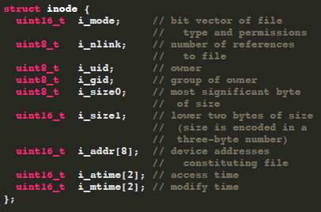
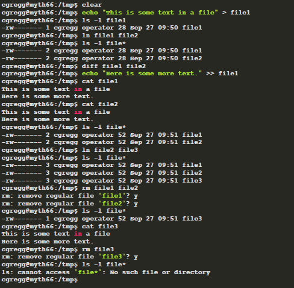

# Lecture 03: Layering, Naming, and Filesystem Design

Storage has its own divided layer called `sector` and filesystem has `block`. So multiple sectors can be bounded to one block.

## 1. Filesystem

The diagram below includes illustrations for a 32 byte (blue) and a 1028 (or 2 * 512 + 4) (green) byte
file


<p align = "center">
Fig.1 - filsystem
</p>

* The first block is the boot block, which typically contains information about the hard drive itself. It's
so named because its contents are generally tapped when booting

* The second block is the superblock, which contains information about the filesystem imposing itself
onto the hardware.

* The rest of the metadata region (at most
10%) stores the inode table, which at the highest level stores information
about each file stored somewhere within the filesystem.

* File payloads are stored in quantums of 512 bytes (or whatever the block size is).

## 2. Inode

`inodes` are data structures that store metainfo about a single file. Stored within an inode are items
like file owner, file permissions, creation times, and, most importantly for our purposes, file type, file
size, and the sequence of blocks enlisted to store payload. (So if you clear inode area, you cannot find your files)

32 bytes / inode -> 16 inodes / block



Each `directory` (one type of file) has its own inumber, and that inode directs contents, which contains path string and inumber (blue contents of [Fig.1 - filsystem]) - 14 bytes for filename string, 2 bytes for inumber. (so, in this os, we cannot make filename longer than 14 and actually ms dos was like this - 8 for name and 3 for extension)

What does the file lookup process look like, then? Consider a file at
'/usr/class/cs110/example.txt'. First, we find the inode for the file /(which always has
inumber 1. See [here](https://stackoverflow.com/questions/2099121/why-do-inode-numbers-start-from-1-and-not-0) about why it is 1 and not 0). We search inode 1's payload for the token 'usr' (linear search)
and its companion inumber. Let's say it's at inode 5. Then, we get inode 5's contents (which is
another directory) and search for the token class in the same way. From there, we look up the
token 'cs110' and then 'example.txt'. This will (finally) be an inode that designates a file, not a
directory.

## 3. Inode: Indirect addressing

Inodes can only store a maximum of 8 block numbers. This presumably
limits the total file size to 8 * 512 = 4096 bytes. That's way too small for any reasonably sized file.

To resolve this problem, we use a scheme called `indirect addressing`. Instead of block storing files, it stores inumbers(block numbers). In singly-indirect addressing, we could store up to 8 (actually 7) singly indirect block numbers in an inode, and each can store 512 /
2 = 256 block numbers. This increases the maximum file size to 8 * 256 * 512 = 1,048,576
bytes = 1 MB.

To make the max file size even bigger, Unix V6 uses the 8th block number of the inode
to store a doubly indirect block number. The total number of singly indirect block numbers we can have is 7 + 256 = 263, so the maximum file size
is 263 * 256 * 512 = 34,471,936 bytes = 34MB.

That's still not very large by today's standards, but remember we're referring to a file system design from
1975, when file system demands were lighter than they are today. In fact, because inumbers were only 16
bits, and block sizes were 512 bytes, the entire file system was limited to 32MB.

> Q.what's 'flag' to use indirect addressing?
> <br> > system looks at filesize (i_size0, i_size1) and if it's larger than 4096, flag is set.


## 4. Inode: Hard link and Soft link

Hard link (`ln <original-file> <new-file>`) increase original file's `i_nlink` in that inode. A file is removed from the
disk only when this reference count becomes 0, and when no
process is using the file (i.e., has it open). This means, for instance,
that rm filename can even remove a file when a program has it
open, and the program still has access to the file (because it
hasn't been removed from the disk). This is not true for many
other file systems (e.g., Windows)!



Soft link (`ln -s <original-file> <new-file>`) is a special file
that contains the path of another file, and has no reference to the inumber. Reference count for the original file
remains unchanged. If we delete the original file, the soft link
breaks! The soft link remains, but the path it
refers to is no longer valid. If we had
removed the soft link before the file, the
original file would still remain.


# Lecture 04: Files, Memory, and Processes


## 1. File Descriptor


Linux maintains a data structure for each active process. (Actually, linux handles all thing like 'file') These data structures are called `process control blocks`, and they are stored in the `process table`. Process control blocks store many things (the user who launched it, what time it was launched, CPU
state, etc.). Among the many items it stores is the `file descriptor table`. A `file descriptor` (used by your program) is a small integer that's an index into this table. It is the identifier needed to interact with a resource (most often a file) via
system calls. 


Descriptors 0, 1, and 2 are standard input, standard output, and standard error, but there are
no predefined meanings for descriptors 3 and up. When you run a program from the terminal,
descriptors 0, 1, and 2 are most often bound to the terminal.

When allocating a new file descriptor, kernel chooses the smallest available number. These semantics are important! If you close stdout (1) then open a file, it will be assigned
to file descriptor 1 so act as stdout (this is how $ cat in.txt > out.txt works)


If a descriptor table entry is in use, it maintains a link to an `open file table entry`. An open file table entry maintains information about an active session (current position) with a file (or something that behaves like a file like terminal, or a network connection).

`mode` tracks whether we're reading, writing, or both. `cursor` tracks a position within the file payload. `refcount` tracks the number of descriptors across all processes that refer to that session.

Each open file entry has a pointer to a `vnode`, which is a
structure housing static information about a file or filelike
resource. The vnode is the kernel's abstraction of an actual file: it includes information on what kind of file
it is, how many file table entries reference it, function pointers for performing operations, and copy of an inode from disk. A vnode's interface is filesystem independent, but its implementation is filesystem
specific; any file system (or file abstraction) can put state it needs to in the vnode (e.g., inode number)


## 2. System Calls

System calls are functions that our programs use to interact with the OS and request some core service be executed on their behalf:  open, read, write, close, stat, and lstat.

Functions like printf, malloc, and opendir aren't themselves system calls. They're C library functions that themselves rely on system calls to get their jobs done.

### Recap: memory area


* code segment stores all of the assembly code instructions specific to your process. 
* data segment intentionally rests directly on top of the code segment, and it houses all of the explicitly initialized global variables that can be modified by the program.
* heap is a software-managed segment used to support the implementation of malloc, realloc, free, and their C++ equivalents.
* user stack segment provides the memory needed to manage user function call and return along with the scratch space needed by function parameters and local variables.
* rodata segment also stores global variables, but only those which are immutable—i.e. constants.
* bss segment houses the uninitialized global variables, which are defaulted to be zero
* shared library segment links to shared libraries like libc and libstdc++ with code for routines like C's printf, C's malloc, or C++'s getline.

### kernel space

System calls like open and stat need access to OS implementation detail that should not be exposed or otherwise accessible to the user program. That means the activation records for system calls need to be stored in a region of memory that users can't touch, and the system call implementations need to be executed in a privileged, superuser mode so that it has access to information and resources that traditional functions shouldn't have.

Housed within kernel space is a kernel stack segment, itself used to organize stack frames for system calls.

We know that callq is used for user function call, but callq would dereference a function pointer we're not permitted to dereference, since it resides in kernel space. So, how user can call system function? 

The system issues a software interrupt (otherwise known as a trap) by executing `syscall`, which prompts an `interrupt handler` to execute in superuser mode.

The interrupt handler builds a frame in the kernel stack, executes the relevant code, places any return value in %rax\*, and then executes iretq to return from the interrupt handler, revert from superuser mode, and execute the instruction following the syscall.

\* The relevant opcode is placed in %rax. Each system call has its own opcode (e.g. 0 for read, 1 for write, 2 for open, 3 for close, 4 for stat, and so forth). If %rax is negative, errno is set to abs(%rax) and %rax is updated to contain a -1.


## 3. Introduction to Multiprocessing: fork

```c
#include <unistd.h>  // fork, getpid, getppid
pid_t pid = getpid();
```

The `fork()` system call creates a new process. It creates a new process that starts on the following instruction after the original, parent, process. The parent process also continues on the following instruction, as well. 

The fork call returns a pid_t (an integer) to both processes. The parent process gets a return value that is the pid of the child process. The child process gets a return value of 0, indicating that it is the child.

If parent process dies eariler than the child process, child's parent becomes root.

All memory is identical between the parent and child, though it is not shared (it is copied - copy on write).

### Example1
```c
int main(int argc, char *argv[]) {
  printf("Greetings from process %d! (parent %d)\n", getpid(), getppid());
  pid_t pid = fork();
  assert(pid >= 0);
  printf("Bye-bye from process %d! (parent %d)\n", getpid(), getppid());
  return 0;
}
```
```console
myth60$ ./basic-fork 
Greetings from process 29686! (parent 29351)
Bye-bye from process 29686! (parent 29351)
Bye-bye from process 29687! (parent 29686)

myth60$ ./basic-fork 
Greetings from process 29688! (parent 29351)
Bye-bye from process 29688! (parent 29351)
Bye-bye from process 29689! (parent 29688)
```

The original process has a parent, which is the shell (pid 29351) -- that is the program that you run in the terminal.

### Example2
```c
static const char const *kTrail = "abcd";
int main(int argc, char *argv[]) {
  size_t trailLength = strlen(kTrail);
  for (size_t i = 0; i < trailLength; i++) {
    printf("%c\n", kTrail[i]);
    pid_t pid = fork();
    assert(pid >= 0);
  }
  return 0;
}
```
```console
myth60$ ./fork-puzzle
a
b
b
c
d
c
d
c
d
d
c
d
myth60$ d 
d
d
```

Fork is used pervasively in applications. For example, the shell forks a new process to run the program. Fork is used pervasively in systems. For example, When your kernel boots, it starts the system.d program, which forks off all of the services and systems for your computer.

# Lecture 05: fork and Understanding execvp

## 1. fork (continued)

### Example3: remember it's virtual memory
```c
int main(int argc, char *argv[]) {
    char str[128];
    strcpy(str, "SpongeBob");
    printf("str's addres is %p\n", str);
    pid_t pid = fork();
    if (pid == 0) { // child
        printf("I am the child. str's address is %p\n", str);
        strcpy(str, "SquarePants");
        printf("I am the child and I changed str to %s. str's address is still %p\n", str, str);
    } else {
        printf("I am the parent. str's address is %p\n", str);
        printf("I am the parent, and I'm going to sleep for 2 seconds.\n");
        sleep(2);
        printf("I am the parent. I just woke up. str's address is %p, and it's value is %s\n", str, str);
    }

    return 0;
}
```
```console
$ ./fork-copy
str's addres is 0x7ffe092639d0
I am the parent. str's address is 0x7ffe092639d0
I am the parent, and I'm going to sleep for 2 seconds.
I am the child. str's address is 0x7ffe092639d0
I am the child and I changed str to SquarePants. str's address is still 0x7ffe092639d0
I am the parent. I just woke up. str's address is 0x7ffe092639d0, and it's value is SpongeBob
```
For both processes above, the pointer value is 0x7ffe092639d0. But, in physical memory, there has been a translation, so that there are actually two different memory locations.

### Example4: waitpid

waitpid can be used to temporarily block a process until a child process exits.
```c
pid_t waitpid(pid_t pid, int *status, int options);
```
return value is the pid of the child that exited, or -1 if waitpid was called and there were no child processes in the supplied wait set.
```c
int main(int argc, char *argv[]) {
  printf("Before.\n");
  pid_t pid = fork();
  printf("After.\n");
  if (pid == 0) {
    printf("I am the child, and the parent will wait up for me.\n");
    return 110; // contrived exit status
  } else {
    int status;
    waitpid(pid, &status, 0)
    if (WIFEXITED(status)) {
      printf("Child exited with status %d.\n", WEXITSTATUS(status));
    } else {
      printf("Child terminated abnormally.\n");
    }
    return 0;
  }
 }
 ```
 ```console
 myth60$ ./separate 
Before.
After.
After.
I am the child, and the parent will wait up for me.
Child exited with status 110.
myth60$
```

The waitpid call also donates child process-oriented resources back to the system. So you should use waitpid for every process using fork.

[See here](https://www.ibm.com/docs/en/zos/2.4.0?topic=functions-waitpid-wait-specific-child-process-end) for macros like `WIFEXITED`.

### Example5: it's virtual, but library is shared.

```c
int main(int argc, char *argv[]) {
    printf("I'm unique and just get printed once.\n");
    bool parent = fork() != 0;
    if ((random() % 2 == 0) == parent) sleep(1);
    if (parent) waitpid(pid, NULL, 0);
    printf("I get printed twice (this one is being printed from the %s).\n",
        parent ? "parent" : "child");
    return 0;
}
```
seems like `random()` could generate different value for each process but it's not. since `random` is sudo random function, parent and child has same return value for random and therefore only one of them sleep. (if you want different value, seed after fork.)

### Example6: multiple childs & ECHILD
```c
int main(int argc, char *argv[]) {
  for (size_t i = 0; i < 8; i++) {
    if (fork() == 0) exit(110 + i);
  } 
  while (true) {  // only master parent will do this
    int status;
    pid_t pid = waitpid(-1, &status, 0);
    if (pid == -1) { assert(errno == ECHILD); break; }
    if (WIFEXITED(status)) {
      printf("Child %d exited: status %d\n", pid, WEXITSTATUS(status));
    } else {
      printf("Child %d exited abnormally.\n", pid);
    }
  }
  return 0;
}
```
`pid == -1` just means that `waitpid` was unsuccessful. So we check errno. [See here](https://www.ibm.com/docs/en/zos/2.4.0?topic=functions-waitpid-wait-specific-child-process-end) for more information.

### Example7: synchronizing with waitpid
```c
int main(int argc, char *argv[]) {
  pid_t children[8];
  for (size_t i = 0; i < 8; i++) {
    if ((children[i] = fork()) == 0) exit(110 + i);
  }
  for (size_t i = 0; i < 8; i++) {
    int status;
    pid_t pid = waitpid(children[i], &status, 0);
    assert(pid == children[i]);
    assert(WIFEXITED(status) && (WEXITSTATUS(status) == (110 + i)));
    printf("Child with pid %d accounted for (return status of %d).\n", 
           children[i], WEXITSTATUS(status));
  }
  return 0;
}
```
```console
myth60$ ./reap-as-they-exit 
Child with pid 4689 accounted for (return status of 110).
Child with pid 4690 accounted for (return status of 111).
Child with pid 4691 accounted for (return status of 112).
Child with pid 4692 accounted for (return status of 113).
Child with pid 4693 accounted for (return status of 114).
Child with pid 4694 accounted for (return status of 115).
Child with pid 4695 accounted for (return status of 116).
Child with pid 4696 accounted for (return status of 117).
myth60$
```

## execvp

execvp effectively reboots a process to run a different program from scratch. Here is the prototype:
```c
int execvp(const char *path, char *argv[]);
```
If execvp fails to cannibalize the process and install a new executable image within it, it returns -1 to express failure. If execvp succeeds, it never returns in the calling process. 

Actually, there are several functions starting with exec (execl, execv, execle, execve, execlp, execvp).
* l: pass argv with char *
* v: pass argv with char *[]
* e: pass environment variable with char *[]
* p: pass path name of the new process image file

### Example
```c
static int mysystem(const char *command) {
  pid_t pid = fork();
  if (pid == 0) {
    char *arguments[] = {"/bin/sh", "-c", (char *) command, NULL};
    execvp(arguments[0], arguments);
    // if execvp succeed, this line will never be read.
    printf("Failed to invoke /bin/sh to execute the supplied command.");
    exit(0);
  }
  int status;
  waitpid(pid, &status, 0);
  return WIFEXITED(status) ? WEXITSTATUS(status) : -WTERMSIG(status);
}

static const size_t kMaxLine = 2048;
int main(int argc, char *argv[]) {
  char command[kMaxLine];
  while (true) {
    printf("> ");
    fgets(command, kMaxLine, stdin);
    if (feof(stdin)) break; 
    command[strlen(command) - 1] = '\0'; // overwrite '\n'
    printf("retcode = %d\n", mysystem(command));
  }
  
  printf("\n");
  return 0;
}
```
Why not call execvp inside parent and forgo the child process altogether? Because
execvp would consume the calling process(what 'cannibalize' means above), and that's not what we want.